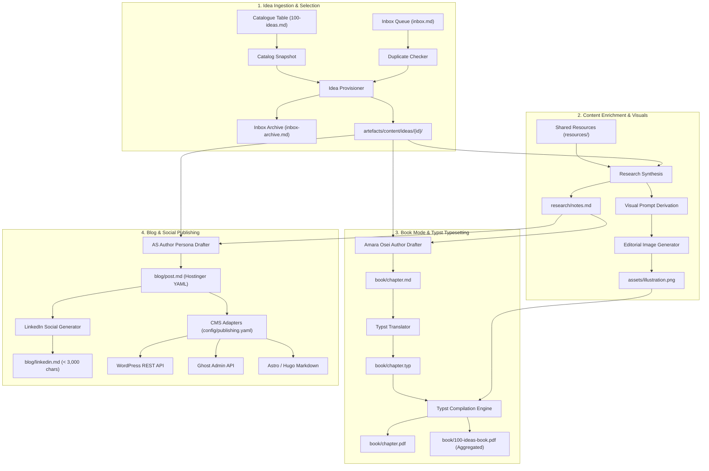

# 100 Ideas: Autonomous Publishing Pipeline

An agentic content publishing framework designed to ingest, enrich, typeset, and publish 100 strategic technology ideas into a publication-grade, typeset book volume (using Typst) and Hostinger-ready, SEO-optimised blog articles with companion social channel assets.

---

## 1. System Overview & Architecture

The 100 Ideas system transforms raw conceptual notes into production-ready publication assets across two primary output streams: **Book Mode** (formal, typeset publication) and **Blog Mode** (opinionated web and social distribution).




---

## 2. Core Subsystems

### 2.1. Idea Ingestion & Selection (`services/ingestion/`)
- **Dual-Path Continuous Ingestion (`REQ-ING-001`, `TASK-016`)**: Ingests batch catalogue entries from `artefacts/product/100-ideas.md` and continuous, irregular submissions from `artefacts/product/inbox.md`.
- **Automated Queue Drainage & Archiving (`TASK-016`)**: Moves provisioned items from `inbox.md` to `artefacts/product/inbox-archive.md` with assigned canonical IDs, timestamps, and provenance tracking.
- **Decoupled Canonical Identifiers (`TASK-016`)**: Generates stable internal asset workspace keys (`idea-001`, `idea-105`, or semantic slugs like `idea-devx-latency`) decoupled from book chapter numbering, with no hardcoded 100 ceiling.
- **Deduplication Engine (`REQ-ING-002`)**: Normalises titles and checks semantic word overlap against catalogue, active ideas, and inbox archive before provisioning.
- **Resilient Synchronisation (`REQ-ING-003`)**: Automatically falls back to `100-ideas.snapshot.md` when external symlinks are unresolvable in sandboxed environments.
- **Canonical Provisioning (`REQ-ING-004`)**: Creates deterministic folder structures with `meta.yaml` under `artefacts/content/ideas/{idea-id}/`.

### 2.2. Content Enrichment & Visuals (`services/enrichment/`)
- **M:N Shared Resource Library (`REQ-ENR-001`)**: Connects ideas to reusable foundational documents in `artefacts/content/resources/`.
- **Thematic Research Synthesis (`REQ-ENR-002`)**: Generates structured dossiers in `research/notes.md` detailing problem context, industry landscape, and architectural implications.
- **Metaphorical Prompt Derivation (`REQ-ENR-003`)**: Synthesises editorial image prompts avoiding clichéd AI tropes.
- **Pure-Python Image Generation (`REQ-ENR-004`)**: Produces valid, high-resolution PNG binaries (`assets/illustration.png`) without external C-library graphics dependencies.

### 2.3. Book Mode & Typst Typesetting (`services/typesetting/`)
- **Author Persona Drafter (`REQ-BOK-001`, `REQ-BOK-002`)**: Implements the Amara Osei persona (`context/persona/author.md`)—prioritising information density, economic reality, bold takeaway lead-ins, and hype puncturing. Supports decoupled chapter numbers.
- **Typst Translator (`REQ-BOK-003`)**: Converts semantic Markdown into clean Typst markup (`chapter.typ`), embedding callouts and vector-scaled figures.
- **Publication-Grade PDF Compilation (`REQ-BOK-004`, `REQ-BOK-005`)**: Uses the subrepo Typst design system (`typst/brands/neutral.typ`) to compile single chapters and unified multi-chapter volumes with Table of Contents and dynamic chapter ordering.
- **Declarative Multi-Volume Compilation (`config/volumes.yaml`)**: Maps curated ideas into thematic publication volumes with custom ordering, thematic parts, descriptions, and chapter title overrides. Dynamically synthesises part divider pages, sequential chapter numbering (`1..N`), and volume-scoped Table of Contents without mutating underlying idea content folders.

### 2.4. Blog & Social Publishing (`services/publishing/`)
- **Author & Blogger Persona (`REQ-BLG-001`)**: Implements the AS author persona (`context/persona/author.md`)—punch over preamble, plain language with physical metaphors ("digital rust", "sweating assets"), bold lead-in takeaways, "So What?" economic equation analysis, and a 400–800 word target length.
- **Hostinger-Ready Standardised YAML Frontmatter (`REQ-BLG-002`)**: Formats blog articles in `blog/post.md` with standardised frontmatter (`title`, `slug`, `date`, `excerpt`, `tags`, `cover_image`, `author`).
- **Companion LinkedIn Channel Posts (`REQ-BLG-003`)**: Generates high-converting LinkedIn posts in `blog/linkedin.md` with punchy hooks, 3–5 bullet takeaways, CTA, hashtags, and < 3,000 characters.
- **Extensible CMS Publication Adapters (`REQ-BLG-004`)**: Configured via `config/publishing.yaml` to export posts to Hostinger Static (Astro/Hugo), WordPress REST API, or Ghost Admin API.

---

## 3. CLI Command Reference (`ideas`)

The project exposes a unified CLI dispatcher `ideas` via Python entrypoints:

```bash
# Ingestion & Synchronisation
uv run ideas sync                                                       # Synchronise catalogue to snapshot
uv run ideas catalog --all --provision                                  # Parse and provision all catalogue ideas
uv run ideas inbox                                                      # Preview pending ideas in inbox.md with duplicate check
uv run ideas inbox --provision                                          # Provision pending ideas and archive to inbox-archive.md
uv run ideas add --title "Title" --synopsis "Synopsis"                  # Add new idea with auto-incremented ID
uv run ideas add --title "Title" --synopsis "Synopsis" --id "idea-devx" # Add idea with custom semantic ID

# Content Enrichment
uv run ideas enrich --idea 1                            # Run research synthesis and visual generation
uv run ideas enrich --idea idea-001 --force             # Force re-generation of research and assets
uv run ideas enrich --idea 1 --regenerate-image         # Re-generate image preserving research

# Book Mode & Typst Compilation
uv run ideas draft --idea 1                             # Draft book chapter manuscript (author persona)
uv run ideas typeset --idea 1                           # Compile single chapter PDF via Typst
uv run ideas typeset --all                              # Compile aggregated book volume with TOC
uv run ideas typeset --volume volume-1                  # Compile specific volume from config/volumes.yaml
uv run ideas typeset --all-volumes                      # Compile all configured volumes

# Blog & Social Publishing
uv run ideas blog --idea 1                              # Draft Hostinger blog post (blogger persona)
uv run ideas blog --idea 1 --platform hostinger_static  # Export using specific CMS adapter
uv run ideas blog --all                                 # Generate blog posts for all ideas
uv run ideas social --idea 1                            # Generate companion LinkedIn social post
```

---

## 4. Operational Guide for AI Agents

When executing automated tasks or subagent delegations within this repository, adhere to the following directory responsibilities and invariants:

### 4.1. Directory Responsibilities

| Path | Owner / Scope | Agent Instructions |
|------|---------------|-------------------|
| `context/` | Canonical Subrepo | **Read-only** during development. Contains shared agent definitions, workflows, personas, and rules managed via `git-subrepo`. Never edit manually. |
| `artefacts/product/` | Requirements & Product | Houses `requirements.md`, `100-ideas.md`, `100-ideas.snapshot.md`, `inbox.md`, and `inbox-archive.md`. |
| `artefacts/architecture/` | System Architecture | Houses `architecture.md`, `data-model.md`, and `agent-app-architecture-comparison.md`. |
| `artefacts/content/ideas/{id}/` | Idea Workspace | Contains all assets for idea `{id}`: `meta.yaml`, `research/`, `assets/`, `book/`, `blog/`. |
| `artefacts/content/resources/` | Shared Library | Houses M:N reusable reference documents (`new-devx-vision.md`, etc.). |
| `artefacts/content/book/` | Publication Builds | Compiled aggregated book PDFs and Typst sources. |
| `artefacts/build/` | Active Coordination | `HANDOFF.md` tracks active phase state; `tasks.md` tracks task IDs and acceptance criteria. |
| `services/` | Application Code | Production Python services (`ingestion`, `enrichment`, `typesetting`, `publishing`). |
| `config/` | Configuration | Deployment and CMS publication settings (`publishing.yaml`). |

### 4.2. Invariants & Guardrails
- **Idempotency**: All pipeline stages skip re-generation if target outputs exist unless `--force` is passed. Always check file presence before spending LLM tokens.
- **Persona Fidelity**: Consult `context/persona/author.md` for both Book Mode chapters and Blog Mode articles.
- **British English Spelling**: All documentation, requirements, and markdown artefacts must strictly use British English spelling (e.g. *synchronised*, *prioritise*, *catalogue*, *modelling*).
- **Typst-Friendly Formatting**: All Markdown files must precede level-2 headings (`## `) with horizontal rules (`---`) and follow diagram fences with at least two blank lines.
- **Clean Commits**: Commit messages must follow the conventional commit format with subject lines under 72 characters.

---

## 5. Testing & Verification

The test suite validates pipeline idempotency, persona compliance, frontmatter schemas, social character limits, and Typst compilation:

```bash
# Run all automated tests
uv run pytest

# Run specific service test suites
uv run pytest services/ingestion/tests/
uv run pytest services/enrichment/tests/
uv run pytest services/typesetting/tests/
uv run pytest services/publishing/tests/

# Execute pre-commit validation checks
uv run pre-commit run --all-files

# Verify runtime adapter synchronisation
uv run agent-drift
```

---

## 6. Upstream Standards Synchronisation

Canonical framework standards are maintained in the upstream `agents-framework` repository and imported via `git-subrepo`:

```bash
# Pull upstream updates from canonical framework
git subrepo pull context

# Recompile runtime adapter projections after pulling updates
uv run agent-harness

# Push local framework improvements back upstream
uv run agent-drift
git subrepo push context
```
