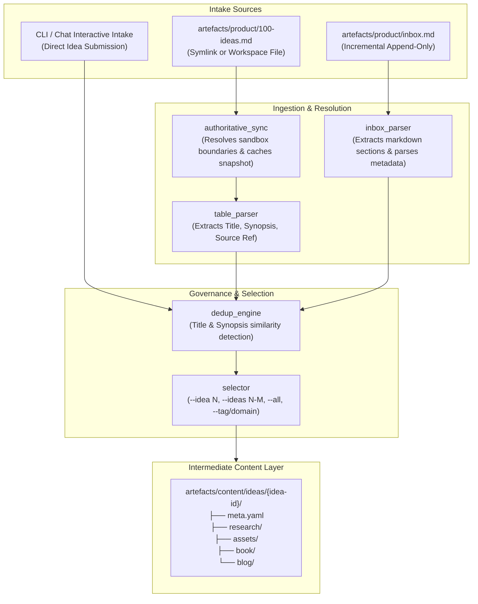
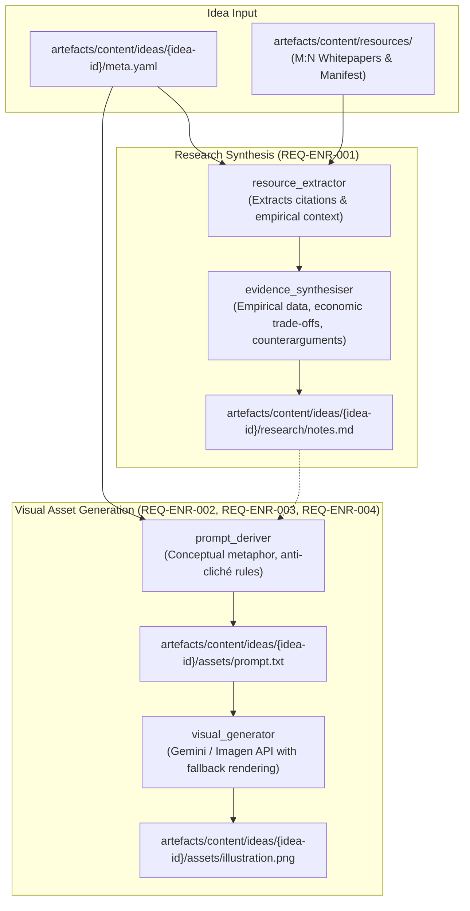
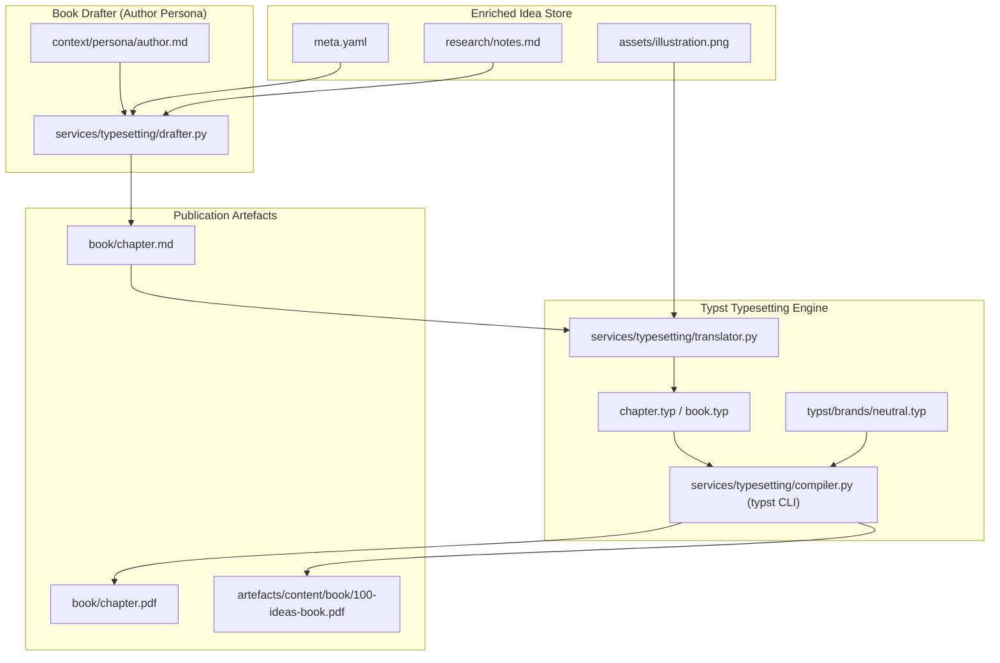
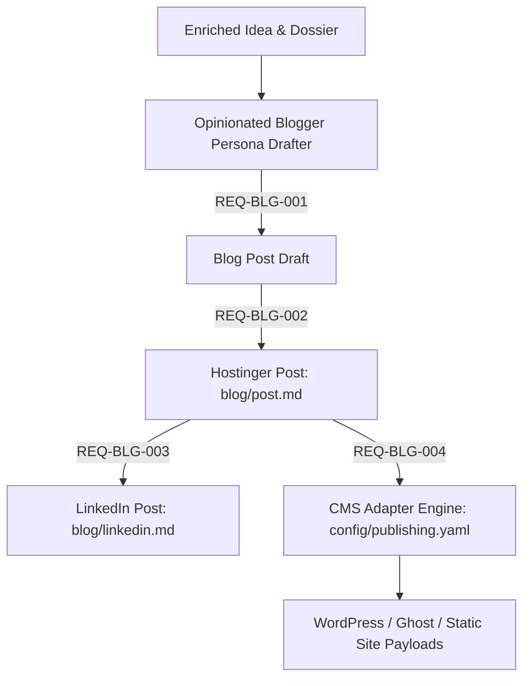

# Architecture: 100-Ideas Agentic Publishing System

> Authoritative architectural specification for the 100-Ideas content pipeline and publishing system.
> Consumed by: solution-architect, python-coder, tech-lead, orchestrator.

**Canonical references**:
- **Product Requirements**: `artefacts/product/requirements.md`

---

## 1. Prototype Architecture: Idea Ingestion & Selection Subsystem (§3.1)

### 1.1 Overview & Data Flow

### 1.2 Key Design Decisions (Prototype)

1. **Local Authoritative Snapshot for Sandbox Safety**:
   - `artefacts/product/100-ideas.md` may point outside the workspace sandbox (e.g. Google Drive symlink).
   - If symlink resolution fails due to permissions, the system falls back to `artefacts/product/100-ideas.snapshot.md`.
   - A sync command (`python -m services.ingestion.cli sync`) copies the authoritative source into the snapshot when outside sandbox access is available.

2. **Canonical Identification Scheme**:
   - Batch catalog ideas receive deterministic sequential IDs: `idea-001`, `idea-002`, ..., based on their 1-indexed table row.
   - Incremental inbox & chat ideas receive the next sequential ID or slugified UUID, ensuring zero collision with batch catalogue ideas.

3. **Intermediate Folder Provisioning**:
   - Upon ingestion/selection, each idea is initialized with `meta.yaml` containing structured YAML frontmatter (id, title, synopsis, source_reference, tags, status, linked_resources, timestamps).
   - Standard subfolders (`research/`, `assets/`, `book/`, `blog/`) are scaffolded automatically.

4. **Fuzzy Deduplication**:
   - Normalised string matching (lowercase alphanumeric token matching) alerts on title or synopsis duplicates before provisioning.

---

## 2. Prototype Architecture: Content Enrichment Subsystem (§3.3)

### 2.1 Overview & Enrichment Pipeline

### 2.2 Key Design Decisions (Enrichment)

1. **Deterministic Resource Extraction Before Synthesis**:
   - The research pipeline parses `meta.yaml` to identify linked resource IDs and locates matching files in `artefacts/content/resources/` (registered in `manifest.yaml`).
   - If citations exist in `source_reference` (e.g. line numbers in `new-devx-vision.md`), the extractor pulls the exact textual paragraphs, eliminating ungrounded hallucinations.

2. **Decoupled Visual Prompting & Independent Regeneration**:
   - The visual prompt is persisted to `assets/prompt.txt` as a first-class artefact.
   - The visual generation phase is isolated from research synthesis, allowing `--regenerate-image` to adjust imagery without triggering redundant research token expenditure (`REQ-ENR-004`).

3. **Idempotent Intermediate Layer**:
   - Prior to making expensive LLM or image generation calls, the subsystem checks if `research/notes.md` or `assets/illustration.png` exists (`REQ-ORC-005`). Reruns are skipped unless explicitly commanded via `--force`.

---

## 3. Shared Content & Intermediate Storage (§3.2)

### 3.1 Directory Structure

- `artefacts/content/ideas/{idea-id}/`
  - `meta.yaml`: Canonical idea state, lineage, tags, timestamps, and model/token telemetry.
  - `research/`: Idea-specific research synthesis and notes (`notes.md`).
  - `assets/`: Generated visuals (`illustration.png`, `prompt.txt`).
  - `book/`: Typeset book chapter drafts (`chapter.md`, `chapter.typ`, `chapter.pdf`).
  - `blog/`: Publication-ready blog drafts and platform frontmatter.
- `artefacts/content/resources/`
  - Centralised M:N library of foundational source whitepapers, book notes, and references.
  - `manifest.yaml`: Global registry of shared resources.
- `artefacts/content/book/`
  - Aggregated multi-chapter book manuscripts and compiled publication volume (`100-ideas-book.pdf`).

---

## 4. Book Mode & Typst Typesetting Subsystem (§3.4)

### 4.1 Subsystem Responsibilities

The Book Mode & Typst Typesetting Subsystem transforms enriched idea dossiers and illustrations into publication-ready book chapters and compiles them into professional PDFs using the embedded Typst typesetting engine (`typst/`).

### 4.2 Key Architectural Decisions

1. **Author Persona Adherence (`REQ-BOK-001`)**:
   - The chapter generator strictly mirrors the style invariants defined in `context/persona/author.md` (the "AS" technologist voice): punch over preamble, plain language, information density, real-world analogues, economic trade-offs, and wry realism.
   - Headings are structural, paragraphs are punchy (2-3 sentences), and chapters integrate scannable callout blocks and structured comparison tables.

2. **Semantic Markdown to Typst Translation (`REQ-BOK-002`, `REQ-BOK-003`)**:
   - Chapter manuscripts are authored in semantic Markdown (`book/chapter.md`) for portable reading and diff tracking.
   - The translator compiles Markdown into clean Typst markup (`chapter.typ`), mapping Markdown callouts to Typst blocks and embedding `#figure(image("..."), caption: [...])` pointing to `assets/illustration.png`.

3. **Subrepo Typst Engine Integration (`REQ-BOK-004`)**:
   - Compilation leverages the system `typst compile` CLI using the project's subrepo design system in `typst/brands/neutral.typ` (clean typography, crisp margins, mathematical styling, and table formatting).
   - Generates vector-sharp PDFs with embedded page numbers, running headers, and metadata.

4. **Unified Multi-Chapter Aggregation (`REQ-BOK-005`)**:
   - The aggregator compiles all processed chapters into `artefacts/content/book/100-ideas-book.pdf`.
   - Generates an automated table of contents, book introduction, structured parts, and cohesive pagination.

---

## 5. Blog & Social Publishing Subsystem Architecture (`REQ-BLG-001` - `REQ-BLG-004`)

The Blog & Social Publishing Subsystem adapts enriched ideas into conversational, opinionated articles formatted for web hosting (e.g. Hostinger, Ghost, WordPress, Astro) and professional social distribution (LinkedIn).

### Core Architecture Components

1. **Dr Sarah Chen Persona Drafter (`REQ-BLG-001`)**:
   - Implements the style defined in `context/persona/opinionated-blogger.md`.
   - Adopts conversational prose with parentheticals (`"(incidentally, a great product...)"`), provocative opening hooks, question-driven section headings, and practical "So What?" implications.
   - Constrained to 400-800 words (2-4 minute read time) with high scannability.

2. **Hostinger-Ready Standardised YAML Frontmatter (`REQ-BLG-002`)**:
   - Generates `artefacts/content/ideas/{idea-id}/blog/post.md` with standardised frontmatter:
     - `title`: Compelling article title.
     - `slug`: URL-friendly identifier.
     - `date`: ISO publication date.
     - `excerpt`: Concise 1-2 sentence teaser.
     - `tags`: List of category and topic tags.
     - `cover_image`: Path to visual asset (`../assets/illustration.png`).
     - `author`: "Dr Sarah Chen".
   - Followed by clean, valid Markdown formatted for web deployment.

3. **Companion Social Post Generator (`REQ-BLG-003`)**:
   - Produces high-converting LinkedIn post in `artefacts/content/ideas/{idea-id}/blog/linkedin.md`.
   - Structures content with a provocative 1-2 line hook, 3-5 bullet takeaways, clear call to action, and 3-5 relevant industry hashtags.
   - Enforces a hard character limit of < 3,000 characters.

4. **Extensible CMS Publication Adapters (`REQ-BLG-004`)**:
   - Configured via `config/publishing.yaml`.
   - Translates normalised blog posts into target CMS formats:
     - **Hostinger Static / Astro / Hugo**: Clean Markdown with customised frontmatter field mappings.
     - **WordPress REST API**: JSON payload with HTML content, excerpt, and categories.
     - **Ghost API**: Mobiledoc or Lexical payload with tags and featured image references.

---

## 6. Related Documents

- **Product Requirements**: [requirements.md](product/requirements.md)
- **Conceptual Data Model**: [data-model.md](data-model.md)
- **Author Persona**: [context/persona/author.md](../../context/persona/author.md)
- **Blogger Persona**: [context/persona/opinionated-blogger.md](../../context/persona/opinionated-blogger.md)
- **Typst Typesetting Subrepo**: [typst/README.md](../../typst/README.md)
- **Publishing Configuration**: [config/publishing.yaml](../../config/publishing.yaml)
- **Architecture Comparison Guide**: [agent-app-architecture-comparison.md](product/agent-app-architecture-comparison.md)
- **Task Tracking**: [tasks.md](../build/tasks.md)

