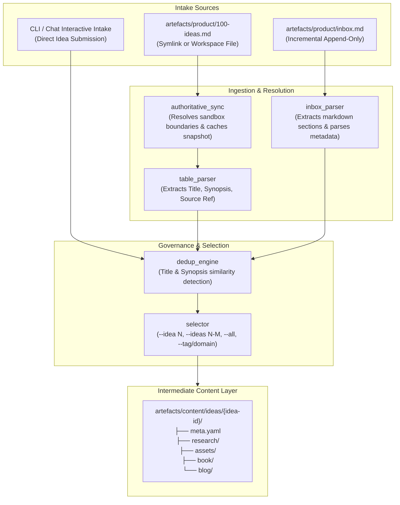
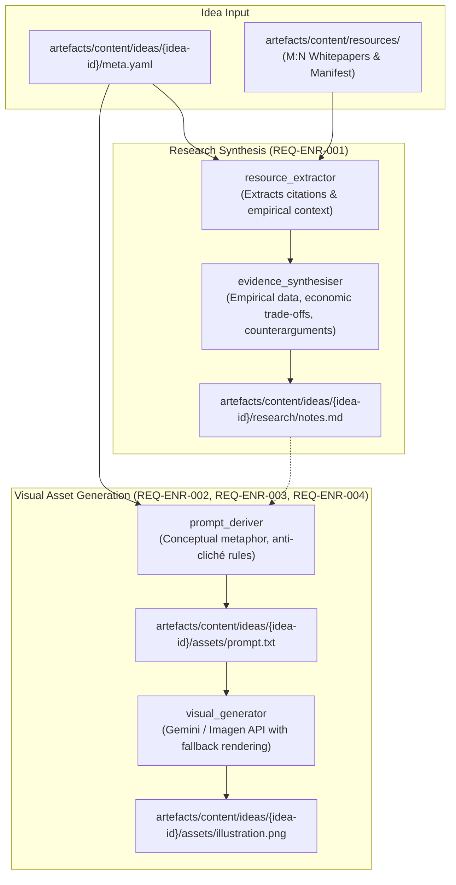

# Architecture: 100-Ideas Agentic Publishing System

> Authoritative architectural specification for the 100-Ideas content pipeline and publishing system.
> Consumed by: solution-architect, python-coder, tech-lead, orchestrator.

**Canonical references**:
- **Product Requirements**: `artefacts/product/requirements.md`

---

## 1. Prototype Architecture: Idea Ingestion & Selection Subsystem (§3.1)

### 1.1 Overview & Data Flow

### 1.2 Key Design Decisions (Prototype)

1. **Local Authoritative Snapshot for Sandbox Safety**:
   - `artefacts/product/100-ideas.md` may point outside the workspace sandbox (e.g. Google Drive symlink).
   - If symlink resolution fails due to permissions, the system falls back to `artefacts/product/100-ideas.snapshot.md`.
   - A sync command (`python -m services.ingestion.cli sync`) copies the authoritative source into the snapshot when outside sandbox access is available.

2. **Canonical Identification Scheme**:
   - Batch catalog ideas receive deterministic sequential IDs: `idea-001`, `idea-002`, ..., based on their 1-indexed table row.
   - Incremental inbox & chat ideas receive the next sequential ID or slugified UUID, ensuring zero collision with batch catalogue ideas.

3. **Intermediate Folder Provisioning**:
   - Upon ingestion/selection, each idea is initialized with `meta.yaml` containing structured YAML frontmatter (id, title, synopsis, source_reference, tags, status, linked_resources, timestamps).
   - Standard subfolders (`research/`, `assets/`, `book/`, `blog/`) are scaffolded automatically.

4. **Fuzzy Deduplication**:
   - Normalised string matching (lowercase alphanumeric token matching) alerts on title or synopsis duplicates before provisioning.

---

## 2. Prototype Architecture: Content Enrichment Subsystem (§3.3)

### 2.1 Overview & Enrichment Pipeline

### 2.2 Key Design Decisions (Enrichment)

1. **Deterministic Resource Extraction Before Synthesis**:
   - The research pipeline parses `meta.yaml` to identify linked resource IDs and locates matching files in `artefacts/content/resources/` (registered in `manifest.yaml`).
   - If citations exist in `source_reference` (e.g. line numbers in `new-devx-vision.md`), the extractor pulls the exact textual paragraphs, eliminating ungrounded hallucinations.

2. **Decoupled Visual Prompting & Independent Regeneration**:
   - The visual prompt is persisted to `assets/prompt.txt` as a first-class artefact.
   - The visual generation phase is isolated from research synthesis, allowing `--regenerate-image` to adjust imagery without triggering redundant research token expenditure (`REQ-ENR-004`).

3. **Idempotent Intermediate Layer**:
   - Prior to making expensive LLM or image generation calls, the subsystem checks if `research/notes.md` or `assets/illustration.png` exists (`REQ-ORC-005`). Reruns are skipped unless explicitly commanded via `--force`.

---

## 3. Shared Content & Intermediate Storage (§3.2)

### 3.1 Directory Structure

- `artefacts/content/ideas/{idea-id}/`
  - `meta.yaml`: Canonical idea state, lineage, tags, timestamps, and model/token telemetry.
  - `research/`: Idea-specific research synthesis and notes (`notes.md`).
  - `assets/`: Generated visuals (`illustration.png`, `prompt.txt`).
  - `book/`: Typeset book chapter drafts.
  - `blog/`: Publication-ready blog drafts and platform frontmatter.
- `artefacts/content/resources/`
  - Centralised M:N library of foundational source whitepapers, book notes, and references.
  - `manifest.yaml`: Global registry of shared resources.

---

## 4. Related Documents

- **Product Requirements**: [requirements.md](product/requirements.md)
- **Conceptual Data Model**: [data-model.md](data-model.md)
- **Idea Catalogue**: [100-ideas.md](product/100-ideas.md)
- **Ideas Inbox**: [inbox.md](product/inbox.md)
- **Task Tracking**: [tasks.md](../build/tasks.md)

