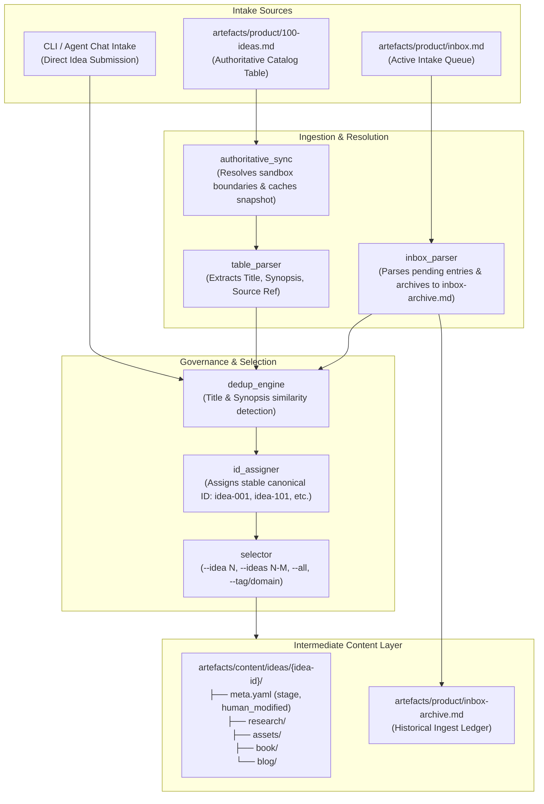
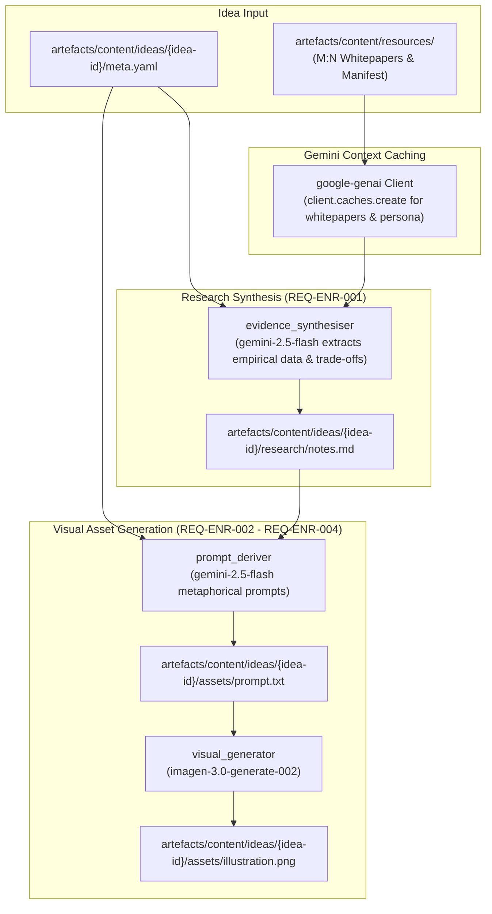
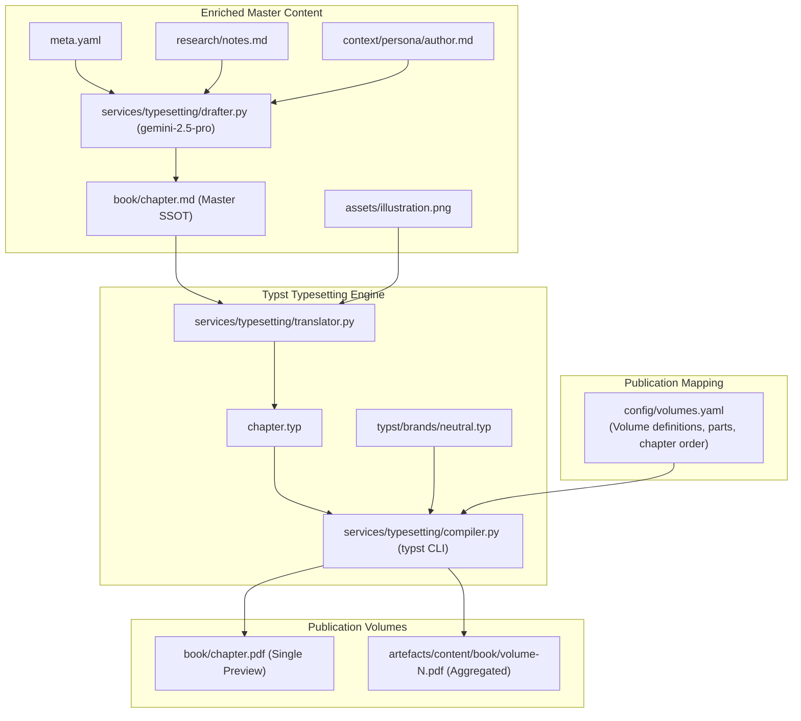
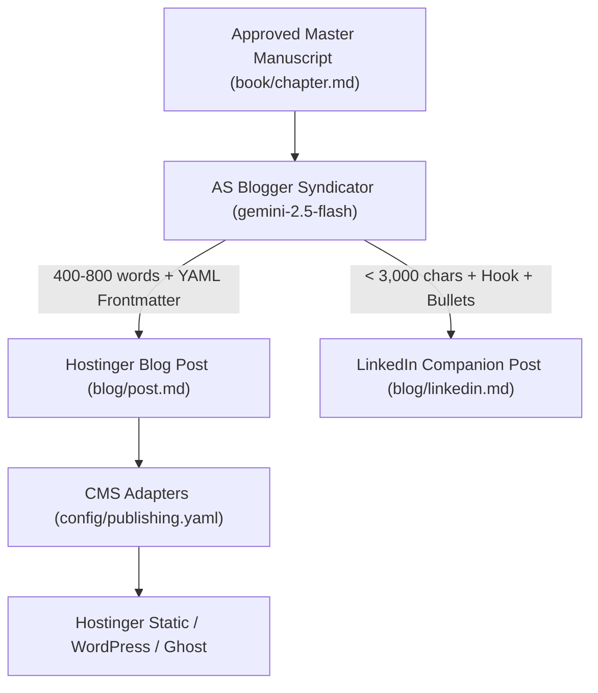

# Architecture: 100-Ideas Agentic Publishing System

> Authoritative architectural specification for the 100-Ideas content pipeline and publishing system.
> Consumed by: solution-architect, python-coder, tech-lead, orchestrator.

**Canonical references**:
- **Product Requirements**: `artefacts/product/requirements.md`

---

## 1. Idea Ingestion & Selection Subsystem (§3.1)

### 1.1 Overview & Data Flow




### 1.2 Key Design Decisions (Continuous Ingestion)

1. **Active Intake Queue with Archiving**:
   - `artefacts/product/inbox.md` acts as an active intake queue containing only unprovisioned ideas.
   - Upon running `ideas inbox --provision`, provisioned entries are atomically removed from `inbox.md` and appended to `artefacts/product/inbox-archive.md` with their assigned canonical ID and ingestion timestamp.
   - Eliminates duplicate warnings on subsequent runs and provides clear provenance.

2. **Decoupled Canonical Identification Scheme**:
   - Ideas receive persistent, immutable folder identifiers (`idea-001`, `idea-042`, `idea-105` or slugged IDs `idea-devx-latency`).
   - The idea ID carries zero semantic coupling to publication chapter order. Chapter sequencing is governed dynamically by `config/volumes.yaml`.

3. **Open-Ended Capacity (Removing the 100 Ceiling)**:
   - The system supports arbitrary numbers of ideas (> 100) across continuous intake streams without hardcoded floor or ceiling restrictions.

4. **Fuzzy Deduplication**:
   - Token-level and character similarity scoring prevents accidental duplicate provisioning while allowing `--force` overrides when intentional.

---

## 2. Content Enrichment Subsystem (§3.3)

### 2.1 Overview & Enrichment Pipeline




### 2.2 Key Design Decisions (Live Gemini & Grounding)

1. **Official Gemini SDK Integration (`google-genai`)**:
   - Replaces synthetic mock generators with the modern `google-genai` Python SDK.
   - API key resolved securely from `.env` via `python-dotenv`.

2. **Native Context Caching & Token Governance**:
   - Foundational whitepapers in `artefacts/content/resources/` (e.g. `new-devx-vision.md`) and author persona definitions are registered into a Gemini Context Cache (`client.caches.create`).
   - Reusable context reduces token consumption by up to 75% across repeated research and drafting invocations.
   - Cumulative token usage (prompt, completion, cached, latency) is logged atomically to `meta.yaml`.

3. **Deep Resource Grounding**:
   - `services/enrichment/researcher.py` passes linked whitepaper context to `gemini-2.5-flash`, extracting genuine empirical evidence, economic equations, and authoritative citations rather than relying on regex substring heuristics.

4. **Decoupled Visual Prompting & Independent Regeneration**:
   - Prompts are derived using `gemini-2.5-flash` following anti-cliché editorial constraints and persisted to `assets/prompt.txt`.
   - `imagen-3.0-generate-002` produces publication-grade 16:9 and 3:2 PNG illustrations, independently regenerable via `--regenerate-image`.

---

## 3. Shared Content & Intermediate Storage (§3.2)

### 3.1 Directory Structure

- `artefacts/content/ideas/{idea-id}/`
  - `meta.yaml`: Canonical state machine, human modification flags, telemetry, and asset links.
  - `research/`: Grounded empirical research notes (`notes.md`).
  - `assets/`: Generated visuals (`illustration.png`, `prompt.txt`).
  - `book/`: Master chapter manuscripts and Typst sources (`chapter.md`, `chapter.typ`, `chapter.pdf`).
  - `blog/`: Syndicated web and social distribution assets (`post.md`, `linkedin.md`).
- `artefacts/content/resources/`
  - Centralised M:N library of foundational source whitepapers, book notes, and references.
  - `manifest.yaml`: Global registry of shared resources.
- `artefacts/content/book/`
  - Compiled publication volumes (`volume-1.pdf`, `volume-2.pdf`).

### 3.2 Human-in-the-Loop State Machine & Protection

To preserve manual author polish and agentic chat revisions, `meta.yaml` governs an atomic lifecycle:

```yaml
stage: "human_review"          # raw | research_ready | draft_in_progress | human_review | approved | published
human_modified: true           # True if human has manually edited files
locked: false                  # Absolute write-lock
review_status: "approved"      # pending | needs_revision | approved
editorial_quality:
  voice_fidelity: true
  reviewed_by: "Author"
  review_notes: "Approved for volume compilation."
```

- **Protection Invariant**: CLI and agent generation commands abort with an error if target files are marked `human_modified: true` unless an explicit `--overwrite-manual` override is supplied.

---

## 4. Book Mode & Multi-Volume Typst Typesetting Subsystem (§3.4)

### 4.1 Subsystem Architecture

The Book Mode subsystem compiles enriched ideas into publication-grade book volumes using Typst, dynamically configured via `config/volumes.yaml`.




### 4.2 Key Architectural Decisions (Multi-Volume)

1. **Declarative Volume Mapping (`config/volumes.yaml`)**:
   - Decouples idea IDs from publication structure.
   - Volumes define parts, thematic chapter sequencing, title overrides, and front/back matter.
   - Single chapters and full volumes are compiled via `ideas typeset --volume volume-1`.

2. **Author Voice Fidelity (`REQ-BOK-001`)**:
   - Chapter drafting leverages `gemini-2.5-pro` under the authoritative AS persona (`context/persona/author.md`): punch over preamble, plain language with physical metaphors, information density, economic equation analysis, and hype puncturing.

3. **Master Single Source of Truth (SSOT)**:
   - `book/chapter.md` serves as the authoritative, human-reviewed technical exposition from which downstream blog and social channels syndicate.

---

## 5. Blog & Social Publishing Subsystem Architecture (§3.5)

### 5.1 SSOT Syndication Model

Rather than generating blog and social assets in parallel from raw synopses (which causes channel drift), Blog Mode derives directly from the approved master chapter manuscript:




### 5.2 Dual-Target Asset Resolution
- For Typst compilation, visual assets resolve to local filesystem relative paths (`../assets/illustration.png`).
- For CMS publishing, the adapter maps assets to web-ready paths or hosted CDN URLs (`web_cover_url` in `meta.yaml`).

---

## 6. Interactive Revision Loop & Agentic Chat Protocol

1. **Human-in-the-Loop Collaboration**:
   - The CLI handles automated, headless batch execution and compilation.
   - The agentic chat interface handles iterative authoring, qualitative critique, and section-by-section refinement.
2. **Selective Patching**:
   - Conversational critique (e.g. "expand on the economic equation in Chapter 3") triggers focused section edits rather than full document regeneration.
   - Edits update `meta.yaml` to flag `human_modified: true` and trigger Typst single-chapter compilation for immediate visual preview.

---

## 7. Related Documents

- **Product Requirements**: [requirements.md](product/requirements.md)
- **Conceptual Data Model**: [data-model.md](data-model.md)
- **Architecture Review Report**: [review-continuous-publishing.md](review-continuous-publishing.md)
- **Volume Mapping Configuration**: `config/volumes.yaml`
- **Author & Blogger Persona**: [context/persona/author.md](../../context/persona/author.md)
- **Typst Typesetting Subrepo**: [typst/README.md](../../typst/README.md)
- **Publishing Configuration**: [config/publishing.yaml](../../config/publishing.yaml)
- **Task Tracking**: [tasks.md](../build/tasks.md)


