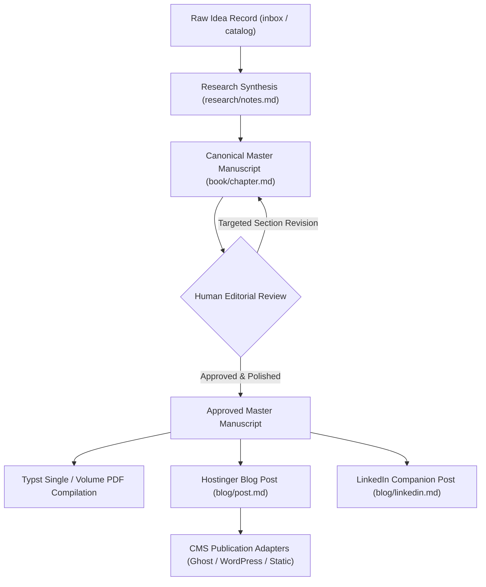
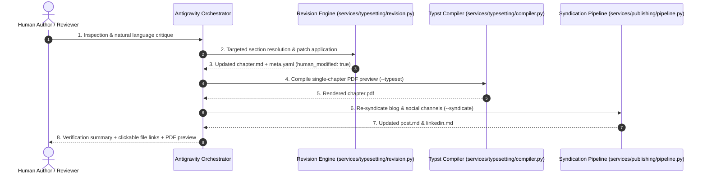

# Interactive Agentic Chat Revision Protocol & SSOT Syndication

---

## 1. Executive Summary

This specification defines the interactive revision protocol and Single Source of Truth (SSOT) syndication model for the **100 Ideas for Engineering Leaders** publishing platform. It operationalises human-in-the-loop editorial collaboration, targeted section refinement, and cross-channel consistency across book, blog, and social formats, resolving **DEF-006** and satisfying **TASK-019**.

---

## 2. Single Source of Truth (SSOT) Syndication Model

### 2.1 The Architectural Problem: Channel Drift
In naive multi-channel pipelines, book chapters, blog posts, and social snippets are generated independently from a shared raw synopsis. This creates substantial editorial drift:
- Manual improvements and empirical refinements made to a chapter manuscript are lost in downstream channels.
- Blog articles diverge in tone and argument from the formal book chapter.
- Social snippets quote outdated claims or miss nuanced trade-offs clarified during chapter review.

### 2.2 The Sequential Syndication Hierarchy
To enforce strict semantic alignment, the publishing subsystem adopts a sequential Single Source of Truth hierarchy:




1. **Canonical Master (`book/chapter.md`)**:
   - Represents the complete, rigorous, human-reviewed technical exposition of the idea.
   - Contains all empirical observations, constraint equations, and authoritative takeaways.
2. **Blog Mode Downstream Distillation (`blog/post.md`)**:
   - Consumes the master chapter via `services.publishing.syndication.generate_syndicated_blog_body`.
   - Distills the manuscript into a punchy 400–800 word executive post with Hostinger YAML frontmatter.
   - Extracts the chapter's core operating mechanism, field observations, and economic consequences.
3. **Social Mode Downstream Distillation (`blog/linkedin.md`)**:
   - Consumes the master chapter via `services.publishing.syndication.generate_syndicated_linkedin_post`.
   - Extracts a high-converting hook from the unvarnished reality and maps 3–5 bullet takeaways directly from the chapter's actionable takeaways.
   - Character count is strictly constrained to < 3,000 characters.

---

## 3. Conversational Revision Workflow

While headless execution runs via the CLI (`ideas pipeline`, `ideas typeset`), author-agent collaboration occurs conversationally in the agentic chat interface.

### 3.1 Five-Stage Interaction Loop




### 3.2 Canonical Section Mappings

To enable selective section-by-section regeneration without document clobbering, manuscripts are structured into deterministic semantic sections:

| Canonical Key | Section Header in `chapter.md` | Recognized Aliases | Description |
|---|---|---|---|
| `header` | `# Chapter N: Title ...` | `title`, `subtitle` | Chapter title, subtitle, and illustration link |
| `lead_punch` | `## The Unvarnished Reality` | `lead`, `punch`, `reality`, `unvarnished` | Arresting opening statement without preamble |
| `mechanics` | `## Where the Gears Bind` | `gears`, `mechanism`, `operating_mechanism` | Plain language, physical metaphors, field evidence |
| `economics` | `## The Economic Equation & Trade-offs` | `economic`, `equation`, `tradeoffs`, `trade_offs` | Cost dynamics, maintenance tail, trade-off table |
| `hype` | `## Puncturing the Hype` | `counterarguments`, `wry_realism`, `puncturing` | Sceptical realism and empirical humility |
| `takeaways` | `## Actionable Takeaways` | `actions`, `takeaway`, `actionable_takeaways` | 3–5 bold lead-in bullet points |
| `citations` | `## Grounded Citations & Field References` | `references`, `field_references` | Formal citations and source documents |

---

## 4. Headless & CLI Execution Interface

Targeted refinement can be triggered both programmatically in Python and via the CLI.

### 4.1 CLI Command: `ideas revise`

```bash
# Refine a single section of the master chapter
ideas revise \
  --idea idea-042 \
  --section mechanics \
  --content "We replaced the mechanical gears with an asynchronous event broker. Cycle time dropped from 4 hours to 12 minutes." \
  --notes "Updated mechanics with event broker empirical observations" \
  --reviewer "Avi"

# Refine section from external draft file with automatic syndication and PDF compilation
ideas revise \
  --idea idea-042 \
  --section economics \
  --from-file drafts/idea-042-economics.md \
  --syndicate \
  --typeset
```

### 4.2 Flags & Options
- `--idea`, `-i`: Target idea identifier (e.g. `idea-042` or `42`).
- `--section`, `-s`: Target section name or alias.
- `--content`, `-c`: Direct replacement text.
- `--from-file`: Read replacement text from a file.
- `--append`: Append new text to the existing section instead of replacing.
- `--notes`, `-m`: Editorial rationale recorded in the metadata audit log.
- `--reviewer`, `-r`: Reviewer identity (default: `Avi`).
- `--syndicate`: Automatically re-syndicate `blog/post.md` and `blog/linkedin.md`.
- `--typeset`: Immediately compile a single-chapter Typst PDF preview.

---

## 5. State Machine & Safeguards Integration

Every execution of a targeted revision enforces the platform safeguards established in **TASK-018**:

1. **Human Modification Flag**: `meta.yaml` is updated with `human_modified: true`.
2. **Review Status**: `meta.yaml` transitions to `review_status: needs_revision`.
3. **Lifecycle Stage**: `meta.yaml` transitions to `stage: human_review`.
4. **Audit Trail**: A timestamped revision record is appended to `revisions` in `meta.yaml`:
   ```yaml
   revisions:
     - target: "book/chapter.md"
       section: "mechanics"
       reviewed_by: "Avi"
       timestamp: "2026-09-24T22:15:00Z"
       notes: "Updated mechanics with event broker empirical observations"
   ```
5. **Overwriting Protection**: Automated batch pipeline operations (`ideas pipeline`, `ideas draft`) will refuse to overwrite the modified chapter unless `--overwrite-manual` is explicitly passed.

---

## 6. Concrete Authoring Scenarios

### Scenario A: Reframing Abrupt Transitions
- **Author Prompt**:
  > *"In Chapter 42, the transition into the economic equation feels abrupt. Reframe it using the digital rust metaphor and expand on verification cycle time."*
- **Agent Action**:
  1. Reads `artefacts/content/ideas/idea-042/book/chapter.md`.
  2. Generates revised `economics` section maintaining AS author voice.
  3. Executes `ideas revise -i idea-042 -s economics -c "..." -m "Reframe with digital rust metaphor"`.
  4. Automatically runs `--typeset` to verify layout.
  5. Returns diff and clickable links to the author.

### Scenario B: Adding Empirical Field Evidence
- **Author Prompt**:
  > *"Add our Q3 deployment benchmark to Chapter 42 mechanics: 42% reduction in PR turnaround time."*
- **Agent Action**:
  1. Executes `ideas revise -i idea-042 -s mechanics --append -c "**Field Observation**: 42% reduction in PR turnaround time when syntax boilerplate is synthesised."`.
  2. Executes `ideas blog -i idea-042 -f --overwrite-manual` and `ideas social -i idea-042 -f --overwrite-manual` (or passes `--syndicate`) to ensure immediate cross-channel syndication.
