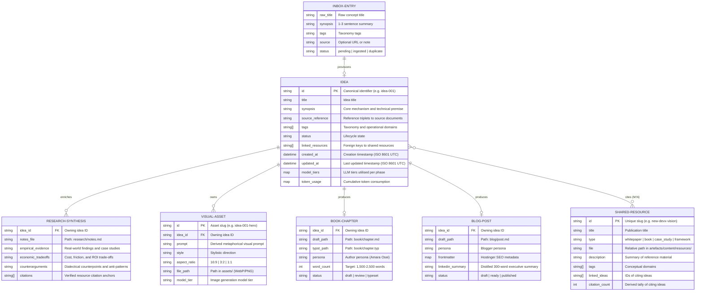

# Conceptual Data Model: 100-Ideas Agentic Publishing System

> Authoritative conceptual data model defining entities, relationships, and business rules across the 100-Ideas content pipeline and publishing system.
> Consumed by: solution-architect, database-designer, python-coder, tech-lead, orchestrator.

**Canonical references**:
- **Product Requirements**: [requirements.md](../product/requirements.md)
- **Architecture**: [architecture.md](architecture.md)

---

## 1. Entity-Relationship Overview

The data architecture operates on a **decoupled, file-based intermediate representation** where shared reference materials are stored centrally (DRY M:N library) and referenced by idea instances without file duplication.




---

## 2. Core Entities

### 2.1 Idea (`IdeaRecord`)

The core aggregate root representing an ingested thesis or operating model insight.

- **Primary Key**: `id` (`idea-{001..NNN}`). Sequential for catalogue items; continuing sequentially for inbox additions.
- **Attributes**:
  - `title`: Non-empty concise title capturing the core mechanism.
  - `synopsis`: 1–3 sentence problem-solution statement.
  - `source_reference`: Explicit citation triplet (Volume, Section, Line) locating the concept in foundational vision texts.
  - `tags`: Operational domains (e.g. `Architecture`, `Tooling`, `Governance`, `Culture`, `Testing`, `ADLC`).
  - `status`: Workflow phase state:
    - `ingested`: Folder scaffolded and `meta.yaml` provisioned.
    - `researching`: Background synthesis in progress.
    - `enriched`: Research notes and visual assets compiled.
    - `drafting`: Book or blog mode active.
    - `complete`: Final artifacts compiled and validated.
  - `linked_resources`: Array of `SHARED-RESOURCE.id` references.
  - `created_at` / `updated_at`: ISO 8601 UTC timestamps.
  - `model_tiers`: Map of subagent model assignments (e.g. `{research: "large", visuals: "medium"}`).
  - `token_usage`: Map of cumulative token usage (e.g. `{input: 12400, output: 3200}`).
- **Storage**: Serialised as `artefacts/content/ideas/{idea-id}/meta.yaml`.

---

### 2.2 Shared Resource (`SharedResource`)

Centralised reference library assets (whitepapers, book notes, empirical studies) supporting M:N reuse across ideas.

- **Primary Key**: `id` (kebab-cased slug, e.g. `new-devx-vision`).
- **Attributes**:
  - `title`: Formal title of the cited work.
  - `type`: Category (`whitepaper`, `book`, `case_study`, `notes`, `framework`).
  - `file`: Path to the source file within `artefacts/content/resources/`.
  - `description`: High-level summary of core concepts.
  - `tags`: Thematic keywords.
  - `linked_ideas`: Array of `Idea.id` values referencing this work.
  - `citation_count`: Cardinality of `linked_ideas`.
- **Storage**: Registered in `artefacts/content/resources/manifest.yaml` alongside source files in `artefacts/content/resources/`.

---

### 2.3 Research Synthesis (`ResearchSynthesis`)

Empirical expansion and evidence dossier compiled during idea enrichment.

- **Foreign Key**: `idea_id` (1:1 with `IdeaRecord`).
- **Attributes**:
  - `empirical_evidence`: Concrete examples, production telemetry, or historical analogies.
  - `economic_tradeoffs`: Opportunity cost, bottleneck migration, and ROI dynamics.
  - `counterarguments`: Dialectical tensions, anti-patterns, and conditions where the idea fails.
  - `citations`: Verbatim quotations and anchor references to linked `SharedResource` entries.
- **Storage**: Markdown document at `artefacts/content/ideas/{idea-id}/research/notes.md`.

---

### 2.4 Visual Asset (`VisualAsset`)

Dynamic conceptual illustration generated to visually convey the idea's core metaphor.

- **Primary Key**: `id` (`{idea-id}-visual-{suffix}`).
- **Foreign Key**: `idea_id` (1:N with `IdeaRecord`).
- **Attributes**:
  - `prompt`: Conceptual imagery prompt derived from idea synopsis and metaphorical themes.
  - `style`: Visual aesthetic guidelines (avoiding generic AI art clichés).
  - `aspect_ratio`: `16:9` for digital/blog; `3:2` or `4:3` for book layouts.
  - `file_path`: Path to image in `artefacts/content/ideas/{idea-id}/assets/`.
  - `model_tier`: Model utilized for generation.

---

### 2.5 Book Chapter (`BookChapter`)

Long-form exposition formatted for compilation into the Typeset Typst volume.

- **Foreign Key**: `idea_id` (1:1 with `IdeaRecord`).
- **Attributes**:
  - `persona`: Technical author persona (Amara Osei).
  - `word_count`: 1,500 to 2,500 words per chapter.
  - `status`: `draft`, `reviewed`, `typeset`.
  - `draft_path`: `artefacts/content/ideas/{idea-id}/book/chapter.md`.
  - `typst_path`: `artefacts/content/ideas/{idea-id}/book/chapter.typ`.

---

### 2.6 Blog Post (`BlogPost`)

Platform-ready, SEO-optimised web article and executive distribution bundle.

- **Foreign Key**: `idea_id` (1:1 with `IdeaRecord`).
- **Attributes**:
  - `persona`: Technical blogger persona.
  - `frontmatter`: Hostinger SEO schema (title, slug, excerpt, date, author, tags, cover_image).
  - `linkedin_summary`: Concise executive summary tailored for professional networks.
  - `status`: `draft`, `ready`, `published`.
  - `draft_path`: `artefacts/content/ideas/{idea-id}/blog/post.md`.

---

### 2.7 Inbox Entry (`InboxEntry`)

Transient raw concept submitted via interactive CLI or appended to `inbox.md`.

- **Attributes**:
  - `raw_title`: User-provided title.
  - `synopsis`: User-provided summary.
  - `tags`: Optional suggested domains.
  - `source`: Optional external link or provenance note.
  - `status`: `pending` (in inbox), `ingested` (promoted to `IdeaRecord`), `duplicate` (rejected).
- **Storage**: Markdown bullet blocks under `## Pending Ingestion` in `artefacts/product/inbox.md`.

---

## 3. Business Invariants & Integrity Rules

1. **Non-Empty Core Fields**:
   Every `IdeaRecord` must possess a non-empty `title` and `synopsis`. Entries lacking either cannot be provisioned.

2. **Deduplication Invariant**:
   Prior to provisioning an incoming idea (via inbox or CLI `add`), the deduplication engine computes token-level and character similarity against existing records. Identical titles or synopsis similarity above threshold (0.75) halt provisioning unless an explicit `--force` override is supplied.

3. **DRY Central Resource Policy**:
   Foundational whitepapers, books, and frameworks reside solely in `artefacts/content/resources/`. Idea folders store references (`linked_resources`) in `meta.yaml` rather than copying source reference files into individual idea directories.

4. **Atomic State Updates**:
   All modifications to an idea's `meta.yaml` execute via atomic file replacement (`.tmp` write followed by POSIX rename) to prevent partial state corruption across agent handoffs or context compaction.

5. **Deterministic Directory Layout**:
   Every provisioned idea folder strictly adheres to the standard subfolder hierarchy:
   ```text
   artefacts/content/ideas/{idea-id}/
   ├── meta.yaml
   ├── research/
   ├── assets/
   ├── book/
   └── blog/
   ```

---

## 4. Related Documents

- **Product Requirements**: [requirements.md](../product/requirements.md)
- **Architecture**: [architecture.md](architecture.md)
- **Shared Resource Library**: `artefacts/content/resources/manifest.yaml`
- **Idea Storage Layer**: `artefacts/content/ideas/`
