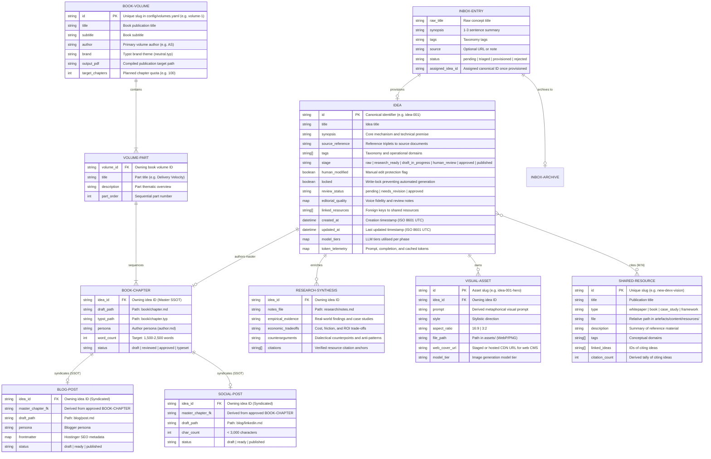

# Conceptual Data Model: 100-Ideas Agentic Publishing System

> Authoritative conceptual data model defining entities, relationships, and business rules across the 100-Ideas content pipeline and publishing system.
> Consumed by: solution-architect, database-designer, python-coder, tech-lead, orchestrator.

**Canonical references**:
- **Product Requirements**: [requirements.md](../product/requirements.md)
- **Architecture**: [architecture.md](architecture.md)

---

## 1. Entity-Relationship Overview

The data architecture operates on a **decoupled, file-based intermediate representation** where shared reference materials are stored centrally (DRY M:N library), ideas maintain an active lifecycle with human-edit protection, and multi-volume publishing is dynamically configured via `config/volumes.yaml`.

---

## 2. Core Entities

### 2.1 Idea (`IdeaRecord`)

The core aggregate root representing an ingested thesis or operating model insight.

- **Primary Key**: `id` (`idea-{001..NNN}` or `idea-{slug}`). Canonical asset workspace identifier; decoupled from book chapter numbering.
- **Attributes**:
  - `title`: Non-empty concise title capturing the core mechanism.
  - `synopsis`: 1–3 sentence problem-solution statement.
  - `source_reference`: Explicit citation triplet (Volume, Section, Line) locating the concept in foundational vision texts.
  - `tags`: Operational domains (e.g. `Architecture`, `Tooling`, `Governance`, `Culture`, `Testing`, `ADLC`).
  - `stage`: Workflow phase state:
    - `raw`: Provisioned from catalog or inbox; awaiting enrichment.
    - `research_ready`: Empirical research synthesis compiled.
    - `draft_in_progress`: Initial book chapter drafted.
    - `human_review`: Draft awaiting author review, chat revision, or manual polish.
    - `approved`: Quality gate and voice fidelity approved.
    - `published`: Compiled into volume PDF and exported to CMS.
  - `human_modified`: Boolean flag indicating manual author edits; protects files from automated overwriting.
  - `locked`: When true, blocks all automated CLI/subagent generation.
  - `review_status`: `pending`, `needs_revision`, `approved`.
  - `editorial_quality`: Structure tracking review validation (`{voice_fidelity: bool, reviewed_by: str, reviewed_at: ISO8601, review_notes: str}`).
  - `linked_resources`: Array of `SHARED-RESOURCE.id` references.
  - `created_at` / `updated_at`: ISO 8601 UTC timestamps.
  - `model_tiers`: Map of subagent model assignments (e.g. `{research: "gemini-2.5-flash", drafting: "gemini-2.5-pro"}`).
  - `token_telemetry`: Telemetry record `{prompt_tokens: int, completion_tokens: int, cached_tokens: int, latency_ms: int}`.
- **Storage**: Serialised as `artefacts/content/ideas/{idea-id}/meta.yaml`.

---

### 2.2 Book Volume (`BookVolume`)

Declarative publication mapping grouping curated ideas into books with custom ordering and parts.

- **Primary Key**: `id` (slug in `config/volumes.yaml`, e.g. `volume-1`).
- **Attributes**:
  - `title`: Formal book title.
  - `subtitle`: Subtitle for cover and headers.
  - `author`: Primary author persona (e.g. `AS`).
  - `brand`: Path to Typst brand styling (e.g. `typst/brands/neutral.typ`).
  - `output_pdf`: Target destination for aggregated compilation (e.g. `artefacts/content/book/volume-1.pdf`).
  - `parts`: Ordered array of parts containing titles and ordered lists of idea references:
    - `chapters`: `[{idea_id: "idea-001", chapter_title_override: null}, ...]`.
- **Storage**: Defined in `config/volumes.yaml`.

---

### 2.3 Shared Resource (`SharedResource`)

Centralised reference library assets (whitepapers, book notes, empirical studies) supporting M:N reuse across ideas.

- **Primary Key**: `id` (kebab-cased slug, e.g. `new-devx-vision`).
- **Attributes**:
  - `title`: Formal title of the cited work.
  - `type`: Category (`whitepaper`, `book`, `case_study`, `notes`, `framework`).
  - `file`: Path to the source file within `artefacts/content/resources/`.
  - `description`: High-level summary of core concepts.
  - `tags`: Thematic keywords.
  - `linked_ideas`: Array of `Idea.id` values referencing this work.
  - `citation_count`: Cardinality of `linked_ideas`.
- **Storage**: Registered in `artefacts/content/resources/manifest.yaml` alongside source files in `artefacts/content/resources/`.

---

### 2.4 Research Synthesis (`ResearchSynthesis`)

Empirical expansion and evidence dossier compiled during idea enrichment, grounded directly in linked shared resources via Gemini.

- **Foreign Key**: `idea_id` (1:1 with `IdeaRecord`).
- **Attributes**:
  - `empirical_evidence`: Concrete examples, production telemetry, or historical analogies extracted from linked resources.
  - `economic_tradeoffs`: Opportunity cost, bottleneck migration, and ROI dynamics.
  - `counterarguments`: Dialectical tensions, anti-patterns, and conditions where the idea fails.
  - `citations`: Verbatim quotations and anchor references to linked `SharedResource` entries.
- **Storage**: Markdown document at `artefacts/content/ideas/{idea-id}/research/notes.md`.

---

### 2.5 Visual Asset (`VisualAsset`)

Dynamic conceptual illustration generated via Imagen 3 to visually convey the idea's core metaphor.

- **Primary Key**: `id` (`{idea-id}-visual-{suffix}`).
- **Foreign Key**: `idea_id` (1:N with `IdeaRecord`).
- **Attributes**:
  - `prompt`: Conceptual imagery prompt derived from idea synopsis and metaphorical themes.
  - `style`: Visual aesthetic guidelines (avoiding generic AI art clichés).
  - `aspect_ratio`: `16:9` for digital/blog; `3:2` for book layouts.
  - `file_path`: Path to image in `artefacts/content/ideas/{idea-id}/assets/`.
  - `web_cover_url`: Optional hosted CDN URL for web CMS publishing.
  - `model_tier`: Model utilized (`imagen-3.0-generate-002`).

---

### 2.6 Book Chapter (`BookChapter`) — Master SSOT

Long-form exposition formatted for compilation into the Typeset Typst volume. Acts as the **Single Source of Truth (SSOT)** for all downstream publishing channels.

- **Foreign Key**: `idea_id` (1:1 with `IdeaRecord`).
- **Attributes**:
  - `persona`: Technical author persona (`context/persona/author.md`).
  - `word_count`: 1,500 to 2,500 words per chapter.
  - `status`: `draft`, `reviewed`, `approved`, `typeset`.
  - `draft_path`: `artefacts/content/ideas/{idea-id}/book/chapter.md`.
  - `typst_path`: `artefacts/content/ideas/{idea-id}/book/chapter.typ`.

---

### 2.7 Blog Post & Social Post (`BlogPost`, `SocialPost`) — Syndicated

Platform-ready, SEO-optimised web article and executive distribution bundle derived hierarchically from the approved master chapter.

- **Foreign Key**: `idea_id` (1:1 with `IdeaRecord`); derives from `BookChapter`.
- **Attributes**:
  - `persona`: Opinionated technical author persona (`context/persona/author.md`).
  - `frontmatter`: Hostinger SEO schema (title, slug, excerpt, date, author, tags, cover_image).
  - `linkedin_summary`: Distilled 3-5 bullet takeaway hook (< 3,000 characters).
  - `status`: `draft`, `ready`, `published`.
  - `draft_path`: `artefacts/content/ideas/{idea-id}/blog/post.md` and `blog/linkedin.md`.

---

### 2.8 Inbox Entry (`InboxEntry`) & Archive

Transient raw concept submitted via interactive CLI or appended to `inbox.md`, archived upon provisioning.

- **Attributes**:
  - `raw_title`: User-provided title.
  - `synopsis`: User-provided summary.
  - `tags`: Optional suggested domains.
  - `source`: Optional external link or provenance note.
  - `status`: `pending` (in inbox), `provisioned` (promoted to `IdeaRecord`), `rejected`.
  - `assigned_idea_id`: Assigned canonical ID (e.g. `idea-101`).
- **Storage**: Active queue in `artefacts/product/inbox.md`; historical log in `artefacts/product/inbox-archive.md`.

---

## 3. Business Invariants & Integrity Rules

1. **Non-Empty Core Fields**:
   Every `IdeaRecord` must possess a non-empty `title` and `synopsis`. Entries lacking either cannot be provisioned.

2. **Continuous Ingestion Archiving**:
   Ingesting an entry from `artefacts/product/inbox.md` must atomically remove it from the active inbox queue and append it to `artefacts/product/inbox-archive.md` with its assigned canonical ID and ingestion timestamp.

3. **Human Edit Protection Invariant**:
   If an idea's `meta.yaml` has `human_modified: true`, no automated command (`ideas draft`, `ideas blog`, `ideas pipeline --force`) may overwrite `book/chapter.md`, `blog/post.md`, or `research/notes.md` without an explicit `--overwrite-manual` flag.

4. **Single Source of Truth (SSOT) Syndication Invariant**:
   Blog posts (`blog/post.md`) and social summaries (`blog/linkedin.md`) must be synthesized from the approved `book/chapter.md` master manuscript to prevent inter-channel content drift.

5. **Decoupled Volume Assembly Invariant**:
   Idea identifiers (`idea-001`, `idea-042`) carry no semantic meaning regarding book chapter sequence. Chapter numbers, part partitions, running headers, and table of contents are dynamically derived at compilation time from `config/volumes.yaml`.

6. **DRY Central Resource Policy**:
   Foundational whitepapers, books, and frameworks reside solely in `artefacts/content/resources/`. Idea folders store references (`linked_resources`) in `meta.yaml` rather than copying source reference files into individual idea directories.

7. **Atomic State Updates**:
   All modifications to an idea's `meta.yaml` execute via atomic file replacement (`.tmp` write followed by POSIX rename) to prevent partial state corruption across agent handoffs or context compaction.

---

## 4. Related Documents

- **Product Requirements**: [requirements.md](../product/requirements.md)
- **Architecture**: [architecture.md](architecture.md)
- **Architecture Review Report**: [review-continuous-publishing.md](review-continuous-publishing.md)
- **Volume Mapping Configuration**: `config/volumes.yaml`
- **Shared Resource Library**: `artefacts/content/resources/manifest.yaml`
- **Idea Storage Layer**: `artefacts/content/ideas/`
