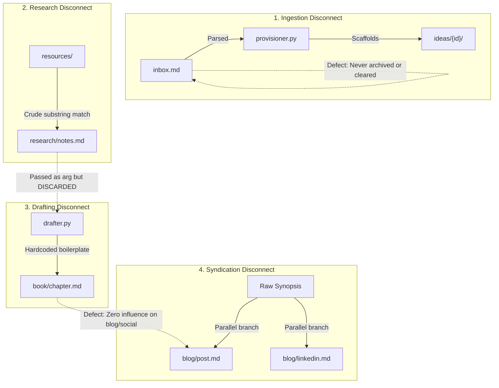
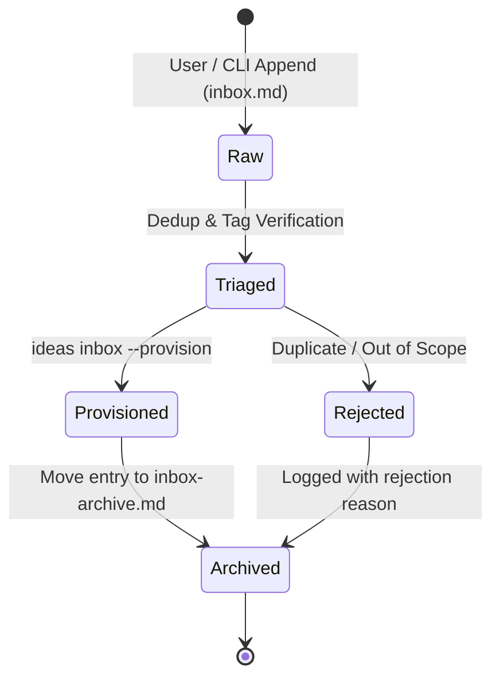
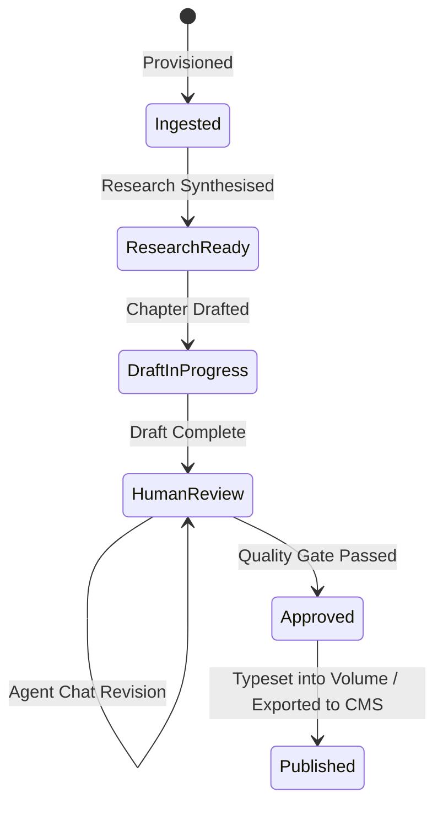
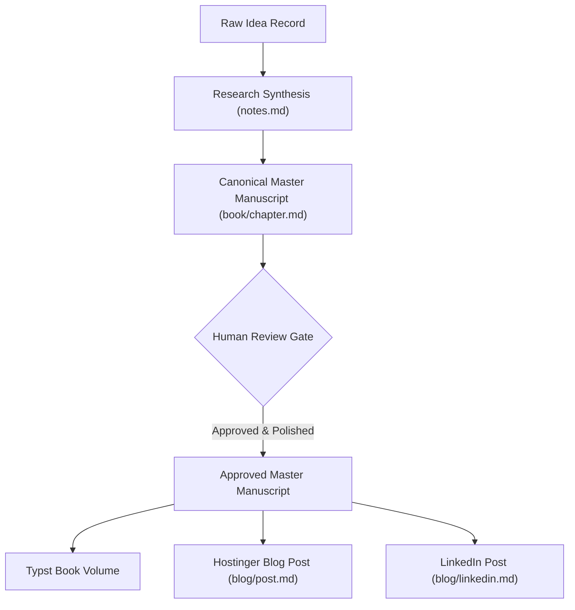

# Architecture Review: Continuous Ingestion, Human-in-the-Loop, and Multi-Volume Architecture

> Authoritative architectural review addressing ingestion assumptions, iterative human-in-the-loop workflows, multi-volume publishing, and live Gemini SDK integration.
> Author: `@solution-architect`
> Status: Approved
> Date: 24/09/2026
> Task: TASK-015

---

## 1. Executive Summary & Review Motivation

During the initial prototyping phase of the 100-Ideas system, implementation focused on proving linear transformation pathways (Markdown table -> Typst PDF -> Hostinger Blog). This produced two critical architectural anti-patterns that restrict production viability:

1. **Static Ingestion Assumption**: The architecture assumed a finite, one-time catalog ingest of 100 ideas (`artefacts/product/100-ideas.md`). In reality, idea discovery is asynchronous and irregular, operating via `artefacts/product/inbox.md`. Coupling an idea's internal database ID (`idea-042`) directly to a book chapter number (`Chapter 42`) broke continuous intake.
2. **One-Shot Transformation Assumption**: The pipeline treated content generation as an automated compiler pass (run once, output final). In reality, publication-grade technical writing demands iterative refinement—both through conversational agentic chat and direct manual editing by human authors. The existing binary idempotency (`if file exists and not force: skip`) resulted in destructive overwrites of human edits whenever `--force` was commanded.

This document details the architectural remediation required to transition the 100-Ideas platform from a one-shot prototype to an iterative, human-in-the-loop publishing pipeline.

---

## 2. End-to-End Data Flow Tracing & Defect Inventory

Applying the *Review Mode: End-to-End Data Flow Tracing* standard to the current codebase revealed several architectural disconnects across the data pipeline:




### 2.1. Identified Pipeline Defects

| Defect ID | Pipeline Location | Observed Behaviour | Architectural Impact |
|---|---|---|---|
| **DEF-001** | `services/ingestion/cli.py` & `parsers.py` | `ideas inbox --provision` reads `inbox.md` but never modifies or clears processed items. | Every subsequent inbox run flags existing items as duplicates; no inbox triage lifecycle. |
| **DEF-002** | `services/ingestion/cli.py` | `max_id_num = 100` hardcoded as ID sequence baseline; `idea.id` converted directly to `Chapter {num}` in `drafter.py`. | Tying database keys to chapter sequences prevents continuous intake, thematic re-ordering, and multi-volume publishing. |
| **DEF-003** | `services/typesetting/drafter.py` | `build_chapter_draft` accepts `research_content: str` parameter, but never reads or interpolates it. | Research notes generated from `artefacts/content/resources/` have zero impact on chapter manuscripts. |
| **DEF-004** | `services/enrichment/visuals.py` & drafters | Visual generation uses synthetic standard-library `zlib` PNG generator; drafters use hardcoded Mad-Libs string templates. | System lacks live Gemini API / Imagen integration, token governance, and error handling. |
| **DEF-005** | Across all services | Binary skip logic (`if exists and not force: return`) causes `--force` to destroy manual edits. | Manual polish and agent chat refinements are obliterated on subsequent batch executions. |
| **DEF-006** | `services/publishing/` | Blog post and LinkedIn summaries are generated in parallel directly from the raw synopsis. | Edits to the book chapter do not propagate to web/social assets (Single Source of Truth violation). |

---

## 3. Continuous Ingestion Lifecycle & Decoupled ID Architecture

### 3.1. Inbox State Transition Lifecycle

The inbox mechanism transitions from a static append-only file to an active intake queue:




1. **Active Intake File (`artefacts/product/inbox.md`)**: Contains only pending ideas awaiting review and provisioning.
2. **Inbox Archive (`artefacts/product/inbox-archive.md`)**: Preserves ingested ideas with assigned canonical IDs, timestamps, and provenance tracking.
3. **Decoupled ID Scheme**: Ideas receive stable canonical identifiers (`idea-001`, `idea-042`, `idea-105` or semantic slugs `idea-devx-latency`). The ID represents an immutable asset workspace key in `artefacts/content/ideas/{id}/` and carries no semantic coupling to publication chapter order.

---

## 4. Multi-Volume Book Configuration & Compilation (`config/volumes.yaml`)

To support publishing multiple 100-idea books, thematic volumes, and staged editions, the publication structure is governed by a declarative configuration file:

```yaml
# config/volumes.yaml
version: "1.0"
volumes:
  volume-1:
    title: "100 Ideas: Volume 1 — Core SDLC & Engineering Friction"
    subtitle: "A Handbook for Technology Leaders"
    author: "AS"
    brand: "typst/brands/neutral.typ"
    output_pdf: "artefacts/content/book/volume-1.pdf"
    parts:
      - title: "Part I: Delivery Velocity & Bottlenecks"
        description: "Deconstructing developer latency, typing speed, and cognitive load."
        chapters:
          - idea_id: "idea-001"
            chapter_title_override: null  # Uses idea title if null
          - idea_id: "idea-014"
      - title: "Part II: Architectural Contracts & Verification"
        chapters:
          - idea_id: "idea-005"
  volume-2:
    title: "100 Ideas: Volume 2 — Platform Economics & Autonomous Agents"
    author: "AS"
    output_pdf: "artefacts/content/book/volume-2.pdf"
    parts:
      - title: "Part I: Agentic Guard Rails"
        chapters:
          - idea_id: "idea-102"
```

### 4.1. Dynamic Typst Assembly
- The Typst compiler reads `config/volumes.yaml` for `--volume <id>`.
- Chapter numbering (`1, 2, ..., N`), running headers, part dividers, and Table of Contents are computed dynamically based on the volume's ordered list.
- An idea can appear in multiple volumes (e.g., a comprehensive edition vs. a targeted executive brief) without altering its underlying content folder.

---

## 5. Human-in-the-Loop & State Machine Architecture

### 5.1. Idea Lifecycle State Machine

Each idea directory maintains an atomic state machine in `artefacts/content/ideas/{id}/meta.yaml`:




### 5.2. `meta.yaml` Extended Schema

```yaml
id: "idea-001"
title: "Decouple Syntax from Architecture"
synopsis: "Software delivery is throttled by manual syntax typing rather than architectural intent."
stage: "human_review"          # ingested | research_ready | draft_in_progress | human_review | approved | published
human_modified: true           # True if human has manually edited chapter.md or post.md
locked: false                  # When true, blocks all automated generation
review_status: "needs_revision"# pending | needs_revision | approved
editorial_quality:
  voice_fidelity: true         # Evaluated against context/persona/author.md
  reviewed_by: "Avi"
  reviewed_at: "2026-09-24T18:15:00Z"
  review_notes: "Tighten section 2 on maintenance overhead."
assets:
  illustration: "assets/illustration.png"
  prompt: "assets/prompt.txt"
  web_cover_url: null          # Populated during CMS staging
token_telemetry:
  prompt_tokens: 3420
  completion_tokens: 1850
  cached_tokens: 28400
  latency_ms: 2150
```

### 5.3. Manual Edit Protection Guard

When executing pipeline generation commands:
1. If `target_file` exists and `meta.yaml` has `human_modified: true`:
   - Command **aborts with an explicit warning**:
     `Refusing to overwrite manual edits in {path}. Use --overwrite-manual to override.`
2. Passing standard `--force` only re-generates assets that are **not** flagged as `human_modified`.
3. An explicit `--overwrite-manual` flag is mandatory to clobber human-curated drafts.

---

## 6. Live Gemini SDK Integration (`google-genai`) & Token Governance

### 6.1. Unified Python Client Integration
The platform adopts the modern `google-genai` SDK using `GEMINI_API_KEY` resolved from `.env` via `python-dotenv`:

```python
from google import genai
from google.genai import types

client = genai.Client()
```

### 6.2. Model Tiering & Responsibilities

| Role | Target Model | Purpose | Input Context |
|---|---|---|---|
| **Research Synthesis** | `gemini-2.5-flash` | Extract empirical evidence, trade-offs, and citations from resources. | Linked whitepapers in `artefacts/content/resources/` |
| **Visual Prompting** | `gemini-2.5-flash` | Synthesise metaphorical prompts avoiding AI clichés. | Title, synopsis, and research notes |
| **Editorial Illustration** | `imagen-3.0-generate-002` | Generate publication-grade 16:9 and 3:2 PNG illustrations. | Derived metaphorical prompt |
| **Book Chapter Drafting** | `gemini-2.5-pro` | High-reasoning author voice synthesis (`author.md`). | Research notes + author persona + synopsis |
| **Syndication (Blog/Social)** | `gemini-2.5-flash` | Distill approved chapter manuscript into punchy blog post and LinkedIn takeaways. | Approved `book/chapter.md` |

### 6.3. Gemini Context Caching Architecture

Foundational whitepapers in `artefacts/content/resources/` (e.g. `new-devx-vision.md`, ~18,000 words) and author personas (`context/persona/author.md`) exceed the 32,768 token caching threshold:
- A shared cache is created:
  ```python
  cache = client.caches.create(
      model="gemini-2.5-pro",
      config=types.CreateCachedContentConfig(
          contents=[resource_texts, author_persona],
          ttl="3600s",
      ),
  )
  ```
- Subsequent drafting and research calls reference `cached_content=cache.name`.
- **Cost Reduction**: Reusable input tokens are discounted by up to 75%, and latency drops significantly across batch executions.

### 6.4. Token Burn Guard Rails & Circuit Breakers

To guard against runaway token expenditure, uncontrolled API loops, and unexpected billing spikes during continuous generation runs, the execution pipeline enforces six non-negotiable guard rails:

1. **Pre-Flight Cost Estimator & Dry Run (`--dry-run`)**:
   - Every CLI execution path (enrichment, drafting, syndication) supports a `--dry-run` flag.
   - Pre-flight token counting uses `client.models.count_tokens` to calculate precise input volume and project total cost (USD) against model pricing tiers before issuing generation requests.

2. **Hard Spend Circuit Breaker**:
   - Environment variables define explicit ceiling parameters: `MAX_SESSION_SPEND_USD` (default `$2.00`) and `MAX_IDEA_TOKENS` (default `50,000` tokens).
   - A central telemetry accumulator tracks cumulative session consumption. If an operation would breach the configured ceiling, execution halts immediately with a `BudgetExhaustedError`, ensuring zero additional token burn.

3. **Cryptographic Input Fingerprinting**:
   - The system computes a SHA-256 fingerprint over the tuple `(model_name, prompt_template_hash, input_documents_hash)`.
   - Before dispatching to Gemini, `meta.yaml` is queried for an identical execution fingerprint. If found, generation is bypassed entirely (zero token burn), returning cached outputs unless `--force-llm` is explicitly supplied.

4. **Context Window Clamping**:
   - Un-cached context injected into prompt payloads is capped at a strict upper ceiling (maximum 12,000 tokens).
   - Long resource documents exceeding this ceiling are either routed through Gemini Context Caching or summarised sequentially to prevent accidental multi-megabyte prompt payloads.

5. **Strictly Sequential Concurrency**:
   - Batch operations enforce strictly sequential execution (`concurrency=1`). Unbounded parallel requests (e.g. `asyncio.gather` over 100 ideas) are forbidden to eliminate runaway billing spirals and rate-limit throttling.

6. **Interactive Batch Confirmation**:
   - Any batch command operating over multiple ideas or passing `--all` prompts with an interactive confirmation showing the aggregate idea count, estimated token burn, and projected USD cost:
     `Ready to process 12 ideas (~145k tokens, est. $0.48 USD). Proceed? [y/N]`
   - Scripted or non-interactive environments must explicitly supply `--yes` to proceed.

### 6.5. Authoring Skill & API Governance (`gemini-sdk`)

A dedicated agent skill (`gemini-sdk`) is defined in `context/skills/gemini-sdk.md` (and projected to `.agents/skills/gemini-sdk/SKILL.md`) to guide engineering agents on idiomatic `google-genai` usage, proper error handling, exponential backoff, structured output via Pydantic schemas, and token conservation patterns.

---

## 7. Single Source of Truth (SSOT) Syndication Model

To prevent multi-channel content drift, the generation hierarchy is re-architected into a sequential syndication flow:




1. **Canonical Master**: `book/chapter.md` represents the complete, rigorous, human-reviewed expression of the idea.
2. **Downstream Distillation**:
   - `blog/post.md` is derived by distilling the *approved chapter* into a punchy 400–800 word web post.
   - `blog/linkedin.md` is derived from the *approved chapter* into a high-converting 3-5 bullet takeaway hook (< 3,000 chars).
3. **Consistency**: Editorial corrections made during book drafting automatically reflect across web and social channels.

---

## 8. Interactive Agentic Chat Revision Protocol

While the CLI remains the headless execution engine, author collaboration takes place in the agentic chat interface:

### 8.1. Conversational Revision Workflow
1. **Inspection**: User reviews `chapter.md` or `post.md` within the editor or typeset PDF preview.
2. **Critique / Amendment**: User gives natural language guidance:
   > *"In Chapter 12, the transition into the economic equation feels abrupt. Reframe it using the digital rust metaphor and expand on verification cycle time."*
3. **Targeted Patching**: The agent extracts the relevant section, constructs a focused prompt with the author persona, generates the revision, applies the patch via precise file editing, and updates `meta.yaml` (`human_modified: true`, `review_status: needs_revision`).
4. **Instant Verification**: Typst single-chapter compilation runs automatically, providing an immediate PDF preview of the revised chapter.

---

## 9. Implementation Roadmap & Sign-Off

This architectural review formally defines the acceptance specifications for downstream implementation tasks:

- **TASK-016**: Refactor continuous ingestion (`inbox.md` archiving, decoupled ID scheme, removing 100-idea floor).
- **TASK-017**: Multi-volume configuration (`config/volumes.yaml`) and dynamic Typst assembly.
- **TASK-018**: State machine in `meta.yaml`, `human_modified` protection guard, and editorial quality gates.
- **TASK-019**: Interactive chat revision loop and SSOT syndication (Book -> Blog -> Social).
- **TASK-020**: Live Gemini SDK (`google-genai`) integration, token burn guard rails, circuit breakers, and `gemini-sdk` skill.

**Sign-off**: Architecture review complete and verified against LESS engineering principles and workspace invariants. Ready for implementation.
