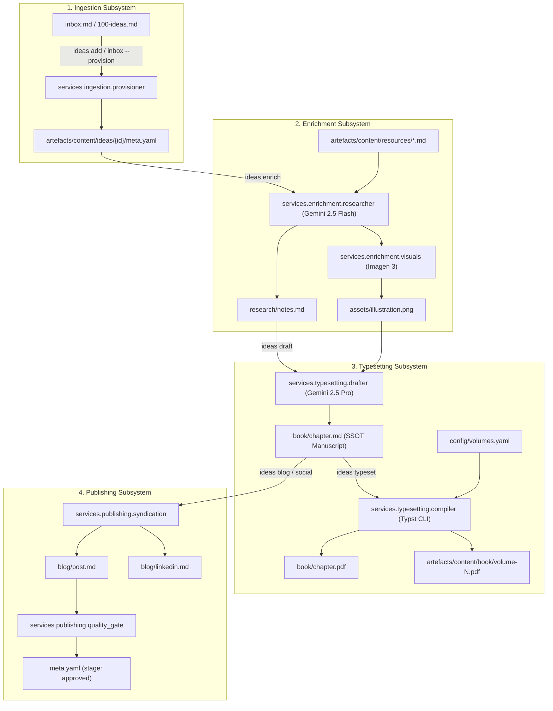
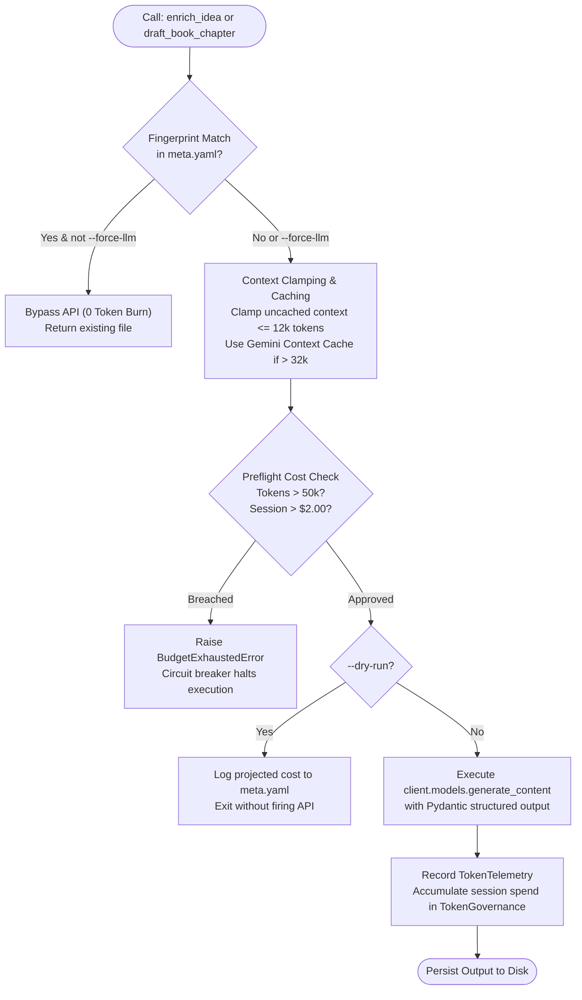

# Developer Onboarding & Code Narrative: 100-Ideas Agentic Publishing System

**Document Status**: Approved  
**Author**: `@tech-lead`  
**Date**: 24/09/2026  
**Audience**: Junior / Intermediate Developers, New Contributors, AI Pair-Programmers  
**Scope**: Full System Tour, Live Gemini Integration, Libraries, Assumptions, and Hardcoded Values  

---

## 1. Welcome to the Codebase

Welcome to the **100-Ideas Agentic Publishing System**!

At its heart, this repository is a high-throughput, automated content engine designed for engineering leaders. It takes raw technical concepts, software engineering patterns, and architecture principles (stored in markdown files or submitted via CLI) and guides them through a multi-stage production pipeline:
1. **Intake & Deduplication**: Captures ideas, normalises metadata, and prevents duplicate concepts.
2. **Content Enrichment**: Researches empirical data from whitepapers using **Gemini 2.5 Flash**, derives metaphorical concepts, and creates visual book illustrations using **Imagen 3**.
3. **Multi-Volume Book Typesetting**: Drafts 1,800–2,500 word publication-grade book chapters in the author's authentic voice using **Gemini 2.5 Pro**, then compiles them into beautiful PDFs using **Typst**.
4. **Channel Syndication**: Repurposes the approved book manuscript into Hostinger-ready blog posts and high-converting LinkedIn companion posts following a **Single Source of Truth (SSOT)** model.
5. **Human-in-the-Loop Safeguards**: Protects manual author revisions, prevents destructive automated overwrites, and enforces strict editorial voice fidelity.

This document serves as your guided tour. It explains how the code works, why specific libraries were chosen, what assumptions the system makes, what values are hard-coded, and specifically how the live Gemini integration and token guard rails operate.

---

## 2. End-to-End Pipeline Architecture

To understand where any piece of code fits, visualise the lifecycle of an idea moving through the directory tree:




### Directory Layout Contract

Every idea in the system lives in its own self-contained directory:
```
artefacts/content/ideas/idea-001/
├── meta.yaml               # State machine, editorial review, telemetry, and links
├── research/
│   └── notes.md            # Empirical evidence, trade-offs, citations
├── assets/
│   ├── prompt.txt          # Visual prompt and artistic direction
│   └── illustration.png    # 16:9 or 3:2 publication-grade artwork
├── book/
│   ├── chapter.md          # Canonical master manuscript (SSOT)
│   ├── chapter.typ         # Pandoc/Typst intermediate markup
│   └── chapter.pdf         # Standalone compiled chapter preview
└── blog/
    ├── post.md             # 400-800 word Hostinger blog post
    └── linkedin.md         # < 3,000 character companion post
```

---

## 3. The Live Gemini Integration & Token Governance

The most critical and sophisticated subsystem in the repository is the **LLM Governance & Live Gemini Integration** located under `services/llm/`.

### 3.1 Why Live LLM Governance Was Built

Calling commercial AI APIs without guard rails in automated pipelines leads to three dangerous failure modes:
1. **Financial Runaway**: A batch script processing 100 ideas with large prompts can accidentally rack up hundreds of dollars in API bills in minutes.
2. **Context Blowouts**: Ingesting raw whitepapers into prompts without token limits can easily breach model context windows or cause severe rate-limiting.
3. **Wasted Compute on Unchanged Content**: Rerunning a pipeline shouldn't call an expensive LLM if the inputs haven't changed.

To solve this, we implemented **6 Token Burn Guard Rails** coordinated through a central singleton:




---

### 3.2 Deep Dive into the 6 Guard Rails

#### Guard Rail 1: Pre-Flight Cost Estimator & `--dry-run`
Before dispatching any live API request, the system calculates the exact prompt token count and projected USD cost. 
If the user passes `--dry-run` (e.g. `ideas enrich --idea 1 --dry-run` or `ideas draft --idea 1 --dry-run`), the system computes the exact projected cost, writes a dry-run telemetry record to `meta.yaml`, and returns immediately without contacting Google servers.

#### Guard Rail 2: Hard Spend Circuit Breakers (`BudgetExhaustedError`)
Implemented in `services/llm/governance.py`:
- `MAX_SESSION_SPEND_USD`: Maximum financial spend permitted within a single CLI run (default: **$2.00**).
- `MAX_IDEA_TOKENS`: Maximum total tokens (prompt + cached + completion) permitted for a single idea operation (default: **50,000 tokens**).

If an operation would push total session spending beyond `$2.00`, or if an idea's projected tokens exceed `50,000`, `gov.check_preflight()` immediately raises `BudgetExhaustedError`. Execution halts instantly—no further API calls can be made.

#### Guard Rail 3: Cryptographic Input Fingerprinting (SHA-256)
How do we know if an idea really needs to be regenerated? We compute a SHA-256 hash of the execution inputs:
```python
fingerprint = compute_input_fingerprint(
    model_name="gemini-2.5-flash",
    prompt_template=prompt_template,
    input_documents=doc_texts,
)
```
The resulting string (e.g. `sha256:4a8b...`) is stored in `meta.yaml` under `token_telemetry.fingerprint`. On subsequent runs, `check_fingerprint_match()` checks whether the fingerprint matches. If it matches, the LLM call is **completely bypassed with zero token burn**, unless the user explicitly forces it with `--force-llm`.

#### Guard Rail 4: Context Clamping & Gemini Context Caching
- **Context Clamping**: When passing referenced whitepapers, `clamp_context(doc, max_tokens=6000)` truncates text to ensure un-cached prompt context never exceeds 12,000 tokens. A clean notice (`[... Context clamped to prevent token budget overload ...]`) is appended.
- **Gemini Context Caching**: If referenced whitepapers or author persona exceed Google's minimum caching threshold of **32,768 tokens**, `services/llm/caching.py` calls `client.caches.create(model=..., config=types.CreateCachedContentConfig(contents=..., ttl="3600s"))`. This slashes token costs by **75%** for repeated drafting calls.

#### Guard Rail 5: Sequential Concurrency (`concurrency=1`)
Batch operations across multiple ideas (such as `ideas pipeline --all`) process ideas strictly sequentially (`concurrency=1`). We deliberately avoid thread pools or `asyncio.gather` for LLM batch calls. This prevents concurrent rate-limit throttling (HTTP 429) and stops parallel tasks from simultaneously burning through the budget.

#### Guard Rail 6: Interactive Batch Confirmation
If a developer runs a batch command like `ideas draft --all`, the CLI calculates the aggregate projected tokens and USD cost across all targeted ideas. It prompts the user for confirmation:
```
Estimated Batch Cost:
  Ideas to process: 12
  Total estimated tokens: 36,000
  Projected financial cost: $0.1800 USD

Proceed with batch LLM execution? [y/N]:
```
Unless the user types `y` or supplies the `-y` / `--yes` flag, the command aborts safely with zero spend.

---

### 3.3 The Core LLM Modules Explained

#### `services/llm/client.py`
Manages the Google GenAI SDK client lifecycle:
- `resolve_api_key(repo_root)`: Locates `.env` and extracts `GEMINI_API_KEY` using `python-dotenv`.
- `is_live_genai_available()`: Returns `True` if a valid API key exists.
- `get_genai_client()`: Returns an authenticated `genai.Client(api_key=api_key)`.

#### `services/llm/governance.py`
Hosts the `TokenGovernance` singleton and pricing logic:
- `MODEL_PRICING`: A dictionary specifying exact prompt, cached, and completion pricing per million tokens.
- `estimate_cost(model, prompt_tokens, completion_tokens, cached_tokens)`: Exact USD calculation.
- `estimate_token_count(text)`: Heuristic estimator (roughly 4 characters per token).
- `clamp_context(text, max_tokens)`: Context truncation rail.
- `compute_input_fingerprint(...)`: SHA-256 fingerprint generator.
- `TokenGovernance`: Accumulates `session_spend_usd`, `session_prompt_tokens`, `session_completion_tokens`.

#### `services/llm/caching.py`
Wraps Google's Context Caching API:
- `GEMINI_CACHE_MIN_TOKENS = 32_768`: Google's hard lower limit for caching.
- `get_or_create_context_cache(...)`: Creates a server-side cache with 1-hour TTL (`ttl="3600s"`) and tracks it in `_CACHE_REGISTRY` to prevent duplicate cache allocations.

#### `services/llm/telemetry.py`
Provides Pydantic models for tracking usage:
- `TokenTelemetry`: Represents a single execution's stats (model, fingerprint, tokens, cost, latency, timestamp).
- `record_telemetry_in_meta(meta_path, telemetry)`: Performs an atomic file write (`.meta.yaml.tmp` replaced into `meta.yaml`) so telemetry is recorded safely without risking file corruption.

---

### 3.4 How Models Are Used in the Pipeline

| Pipeline Stage | Module | Model | Why Chosen | Structured Schema |
| :--- | :--- | :--- | :--- | :--- |
| **Research Synthesis** | `services/enrichment/researcher.py` | `gemini-2.5-flash` | Fast, cost-efficient, excellent at extracting empirical data from whitepapers. | `ResearchDossierSchema` |
| **Visual Art Generation** | `services/enrichment/visuals.py` | `imagen-3.0-generate-002` | Generates high-resolution editorial illustrations without clichés. | N/A (Image Bytes) |
| **Book Chapter Drafting** | `services/typesetting/drafter.py` | `gemini-2.5-pro` | Deep reasoning, nuanced tone adherence, long-form coherence (1,800–2,500 words). | `ChapterManuscriptSchema` |

#### How Structured Output Works
Instead of asking Gemini to output raw markdown and parsing it with regex, we use **Pydantic Schemas**.
In `services/typesetting/drafter.py`:
```python
from google.genai import types
from services.typesetting.models import ChapterManuscriptSchema

config = types.GenerateContentConfig(
    response_mime_type="application/json",
    response_schema=ChapterManuscriptSchema,
    temperature=0.4,
)

response = active_client.models.generate_content(
    model="gemini-2.5-pro",
    contents=full_contents,
    config=config,
)

# Access typed, validated fields directly:
parsed: ChapterManuscriptSchema = response.parsed
print(parsed.lead_punch)
print(parsed.mechanics_section)
print(parsed.economic_section)
print(parsed.takeaways)
```
If the model produces output that violates the Pydantic schema, the SDK handles validation errors immediately.

#### Dual Execution Modes: Live vs Offline Mock Fallback
What happens if you are developing on a train without internet or don't have an API key?
**The system never crashes.** Every single function (`synthesise_research`, `generate_visual_assets`, `draft_book_chapter`) checks `is_live_genai_available()`. If no key is set or if an API call throws an error:
- It falls back to local deterministic synthesis functions (`build_research_dossier`, `_generate_fallback_png`, `build_chapter_draft`).
- It outputs valid markdown and valid PNG files.
- It sets `used_model = "offline-mock"`.
- All 219 tests pass cleanly without network connectivity!

---

## 4. Libraries Used Across the Codebase

Here is every major third-party library used in the project, why it was chosen, and where it is applied:

### 1. `google-genai` (v1.47.0+)
- **Purpose**: Official Python SDK for Google Gemini and Imagen models.
- **Where Used**: `services/llm/client.py`, `services/llm/caching.py`, `services/enrichment/researcher.py`, `services/enrichment/visuals.py`, `services/typesetting/drafter.py`.
- **Key Methods**:
  - `client = genai.Client(api_key=...)`
  - `client.models.generate_content(model=..., contents=..., config=...)`
  - `client.models.generate_images(model="imagen-3.0-generate-002", prompt=..., config=...)`
  - `client.caches.create(model=..., config=types.CreateCachedContentConfig(...))`

### 2. `pydantic` (v2.13.5+)
- **Purpose**: Data parsing, schema validation, and structured output contract definition.
- **Where Used**:
  - `services/enrichment/models.py` (`ResearchDossierSchema`)
  - `services/typesetting/models.py` (`ChapterManuscriptSchema`)
  - `services/llm/telemetry.py` (`TokenTelemetry`)
- **Key Features**: Strong typing, field constraints (`Field(description=...)`), JSON schema generation for Gemini SDK (`response_schema`).

### 3. `python-dotenv` (v1.2.1+)
- **Purpose**: Environment variable management.
- **Where Used**: `services/llm/client.py`.
- **How Used**: Loads key-value pairs from `.env` at the root of the workspace into `os.environ` so secrets are never committed to git.

### 4. `pyyaml` (v6.0+)
- **Purpose**: YAML serialization and deserialization.
- **Where Used**: Everywhere metadata or configuration is parsed or saved: `services/ingestion/models.py`, `services/ingestion/provisioner.py`, `services/typesetting/volumes.py`, `services/publishing/adapters.py`, `services/llm/telemetry.py`.
- **Key Methods**: `yaml.safe_load(text)` and `yaml.safe_dump(data, sort_keys=False, allow_unicode=True)`.

### 5. `pytest` (v9.1.1+)
- **Purpose**: Test suite runner.
- **Where Used**: `services/*/tests/`, `context/scripts/tests/`.
- **How to Run**: Always use `uv run pytest` from the workspace root.

### 6. `ruff`
- **Purpose**: Fast Python linter and formatter.
- **Configuration**: In `pyproject.toml` (`line-length = 100`, `target-version = "py311"`, rules: `E`, `W`, `F`, `I`).
- **How to Run**: `uv run --with ruff ruff check .`

### 7. External CLI: `typst`
- **Purpose**: State-of-the-art PDF typesetting engine (modern LaTeX replacement).
- **Where Used**: `services/typesetting/compiler.py`.
- **How Used**: Invoked as a sub-process: `typst compile <src.typ> <out.pdf>`.

---

## 5. Architectural Assumptions

When writing or modifying code in this repository, keep the following core assumptions in mind:

1. **The Filesystem Is the State Store**:
   There is no PostgreSQL, SQLite, or Redis database. Every idea's state is stored in its local directory (`meta.yaml`, `notes.md`, `chapter.md`, `post.md`). If `meta.yaml` says `stage: "approved"`, the idea is approved.
2. **Deterministic Offline Fallbacks Are Mandatory**:
   Unit tests must NEVER require live internet or an active Google API key. Any new feature calling an external service must provide a fast, local mock fallback.
3. **Decoupled Canonical IDs vs Book Order**:
   An idea's directory name (`idea-001`, `idea-devx-latency`) has **zero semantic relationship** to its chapter number in a book. Chapter numbers are dynamically mapped by `config/volumes.yaml`. An idea named `idea-085` can easily be Chapter 1 in Volume 1.
4. **British English Spelling Is Enforced**:
   All user-facing prose, docstrings, variable names, and documentation must use British English spelling (`behaviour`, `serialise`, `authorise`, `colour`, `artefact`). A pre-commit hook will reject commits containing American spellings like `optimize` or `artifact`.
5. **Date Format Standard**:
   Dates in metadata and documentation must strictly use `DD/MM/YYYY` or ISO 8601 (`YYYY-MM-DD` / `YYYY-MM-DDTHH:MM:SSZ`).
6. **Character-to-Token Ratio**:
   The heuristic estimator in `estimate_token_count` assumes 1 token ≈ 4 characters of English text (`len(text) // 4`). This is a standard approximation used for pre-flight budgeting.

---

## 6. Catalogue of Hardcoded Values

If you need to change system behaviour, here is where the hardcoded constants live:

### LLM Pricing & Budgets (`services/llm/governance.py`)
- `DEFAULT_MAX_SESSION_SPEND_USD = 2.00`: Default session budget cap in USD. (Can be overridden by setting `MAX_SESSION_SPEND_USD` in `.env`).
- `DEFAULT_MAX_IDEA_TOKENS = 50_000`: Default maximum tokens per idea operation. (Can be overridden by setting `MAX_IDEA_TOKENS` in `.env`).
- `DEFAULT_MAX_UNCACHED_CONTEXT_TOKENS = 12_000`: Maximum tokens allowed in an un-cached prompt.
- `GEMINI_CACHE_MIN_TOKENS = 32_768` (`services/llm/caching.py`): Google's minimum token threshold for server-side context caching.
- `MODEL_PRICING`:
  - `gemini-2.5-flash`: `$0.075` prompt, `$0.01875` cached, `$0.30` completion (per 1M tokens).
  - `gemini-2.5-pro`: `$1.25` prompt, `$0.3125` cached, `$5.00` completion (per 1M tokens).
  - `imagen-3.0-generate-002`: `$0.03` per image.

### Prohibited Clichés & Slop Words (`services/publishing/quality_gate.py`)
The editorial quality gate blocks articles containing these AI buzzwords:
`"delve"`, `"testament to"`, `"crucial"`, `"tapestry"`, `"beacon"`, `"revolutionise"`, `"revolutionize"`, `"seamless"`, `"groundbreaking"`, `"pivotal"`, `"furthermore"`, `"it is worth noting that"`, `"in today's fast-paced"`, `"at the end of the day"`.

### Americanism Replacement Pairs (`services/publishing/quality_gate.py`)
`AMERICANISM_REPLACEMENTS`: 40+ mapped pairs (e.g. `optimize` → `optimise`, `defense` → `defence`, `center` → `centre`, `behavior` → `behaviour`).

### Visual Art Style Sets (`services/enrichment/visuals.py`)
- `STYLES`: Swiss modernist, Constructivist architectural, Linocut printmaking, Industrial brutalist, Bauhaus assemblage.
- `COMPOSITIONS`: Centered isometric, Macro perspective, Wide cinematic, Dynamic diagonal rhythm.
- `MOODS`: Cool gallery, High-contrast chiaroscuro, Diffused overcast studio, Dusk ambient glow.
- `METAPHOR_MAP`: Keywords (`constraint`, `loop`, `verification`, `governance`, `code`, `agent`, `bottleneck`) mapped to physical metaphorical objects.

### Word Count Targets
- **Book Chapters** (`services/typesetting/drafter.py`): Target **1,800 to 2,500 words**.
- **Blog Posts** (`services/publishing/drafter.py`, `syndication.py`): Target **400 to 800 words**.
- **LinkedIn Posts** (`services/publishing/social.py`, `syndication.py`): Target **under 3,000 characters**.

---

## 7. Practical Developer Cheatsheet

### 7.1 Setting Up Your Environment
The project uses `uv` for Python virtual environments.
```bash
# Verify uv is installed
uv --version

# Run tests
uv run pytest

# Check adapter synchronization and drift
uv run agent-drift

# Check linting
uv run --with ruff ruff check services/
```

### 7.2 Configuring Live Gemini API
To test live API calls instead of mock generation:
1. Create a `.env` file in the repository root:
   ```bash
   GEMINI_API_KEY="AIzaSyYourActualApiKeyHere"
   MAX_SESSION_SPEND_USD="5.00"
   MAX_IDEA_TOKENS="60000"
   ```
2. Verify with a dry run:
   ```bash
   uv run ideas enrich --idea 1 --dry-run
   ```
3. Run live generation on a single idea:
   ```bash
   uv run ideas enrich --idea 1 --force-llm
   uv run ideas draft --idea 1 --force-llm
   ```

### 7.3 Common CLI Commands
The CLI entry point is `ideas` (mapped via `services/ingestion/cli.py`):
```bash
# Synchronise authoritative catalog to local snapshot
uv run ideas sync

# Ingest new ideas from inbox.md into content store
uv run ideas inbox --provision

# Enrich an idea (research synthesis + visual asset)
uv run ideas enrich --idea 42

# Draft book chapter manuscript
uv run ideas draft --idea 42

# Compile chapter PDF
uv run ideas typeset --idea 42

# Compile an entire multi-volume book
uv run ideas typeset --volume volume-1

# Generate blog post and LinkedIn post (syndicated from chapter.md)
uv run ideas blog --idea 42
uv run ideas social --idea 42

# Run editorial quality gate
uv run ideas review --idea 42

# Apply surgical chat revision to a chapter section
uv run ideas revise --idea 42 --section mechanics --content "New operational text."
```

### 7.4 Handling Manual Overwrite Protection
If an author has edited a file manually, `meta.yaml` will have `human_modified: true`. Automated CLI operations will refuse to overwrite it to protect human work:
```
ManualEditProtectionError: Refusing to overwrite manual edits in chapter.md. Use --overwrite-manual to override.
```
To intentionally overwrite human edits, pass the override flag:
```bash
uv run ideas draft --idea 42 --overwrite-manual
```

---

## 8. Summary & Next Steps for Contributors

You are now equipped with the full context of how the 100-Ideas publishing engine functions!

When you are ready to pick up work:
1. Read the **Codebase Cleanup Report** in [tech-review.md](file:///Users/avi/Repos/100-ideas/artefacts/build/tech-review.md).
2. Check the **Task Backlog** in [tasks.md](file:///Users/avi/Repos/100-ideas/artefacts/build/tasks.md) for scheduled engineering tasks:
   - **TASK-021**: Boundary & SSOT Syndication Wiring Cleanup.
   - **TASK-022**: Decomposing monolithic `services/ingestion/cli.py` into a modular `services/cli/` package.
   - **TASK-023**: Migrating `IdeaRecord` and data models to Pydantic v2.
3. Always verify changes using `uv run pytest` and ensure `git commit` messages follow Conventional Commits with British English spelling.
