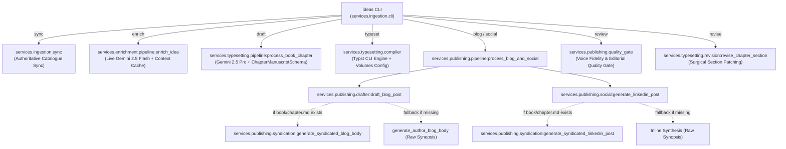
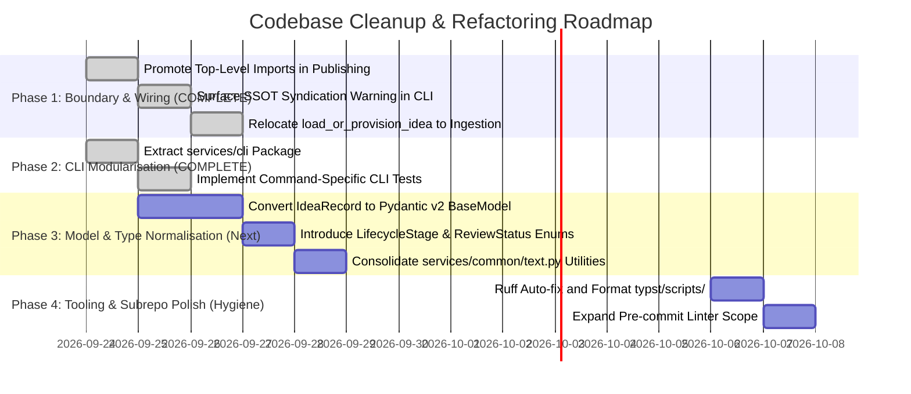

# Technical Lead Codebase Review & Cleanup Report

**Document Status**: Approved  
**Reviewer**: `@tech-lead`  
**Date**: 24/09/2026  
**Scope**: Whole Codebase (`services/`, `typst/`, `context/`, `artefacts/`)  
**Gate Decision**: **APPROVED (with prioritized cleanup backlog)**  

---

## 1. Executive Summary & Architecture Health

Following the successful implementation of live Gemini SDK integration, token governance, and prompt caching (TASK-020), this review conducts a holistic architectural assessment of the **100-Ideas Agentic Publishing System**.

The overall health of the system is strong:

- All **219 unit and integration tests** pass cleanly with zero regression.
- Canonical context and adapter drift checks report **0 drift** across runtime schemas.
- Core business logic adheres to the **LESS Engineering Principles** (Lean, Ethical, Scalable, Sustainable), with strict token burn circuit breakers, cryptographic deduplication, and context caching.

However, rapid phase-to-phase iteration across continuous ingestion (TASK-017), Typst multi-volume typesetting (TASK-018), SSOT syndication (TASK-019), and live LLM governance (TASK-020) has produced architectural debt, boundary leakages, and monolithic entry points that warrant systematic cleanup.

This report documents substantive structural findings, traces user-facing call chains to verify end-to-end wiring, and establishes a phased remediation plan.

---

## 2. End-to-End Call Chain & Wiring Smoke-Check Audit

Per `context/agents/tech-lead.md` and `context/standards/testing-standards.md`, **coverage and test-pass rates do not verify wiring**. A feature can achieve high unit test coverage while remaining disconnected or silently bypassed.

Below is the end-to-end trace from user entry points to backend effects across all primary workflows:




### Wiring Verification Matrix

| Entry Point / Subcommand | Pipeline Handler | Backend Effect | Wiring Verification Status | Findings / Risks |
| :--- | :--- | :--- | :--- | :--- |
| `ideas sync` | `handle_sync_command` | Atomic cache copy to `100-ideas.snapshot.md` | ✅ **Verified** | Clean, deterministic resolution. |
| `ideas enrich` | `handle_enrich_command` → `enrich_idea` | Research notes in `research/notes.md`, image prompt, telemetry in `meta.yaml` | ✅ **Verified** | Live Gemini 2.5 Flash + Context Cache wired with token governance. |
| `ideas draft` | `handle_draft_command` → `process_book_chapter` | `book/chapter.md` via Gemini 2.5 Pro | ✅ **Verified** | `ChapterManuscriptSchema` validated and persisted to disk. |
| `ideas typeset` | `handle_typeset_command` → `compile_chapter_pdf` / `compile_volume_pdf` | Generates PDF artefacts via Typst CLI | ✅ **Verified** | Asset paths correctly resolved via `AssetResolver`. |
| `ideas blog` | `handle_blog_command` → `process_blog_and_social` | `blog/post.md` + optional CMS export | ⚠️ **Partial / Fragile** | Silent fallback to synopsis if `book/chapter.md` missing; lazy inline imports. |
| `ideas social` | `handle_social_command` → `process_blog_and_social` | `blog/linkedin.md` | ⚠️ **Partial / Fragile** | Silent fallback to synopsis; dynamic inline import. |
| `ideas review` | `handle_review_command` → `run_quality_gate` | Quality gate report + stage update in `meta.yaml` | ✅ **Verified** | Correctly transitions stage to `approved` or `human_review`. |
| `ideas revise` | `handle_revise_command` → `revise_chapter_section` | Updates `chapter.md`, sets `human_modified: true`, syndicates if requested | ✅ **Verified** | Preserves revision history and triggers downstream compilation. |

---

## 3. Detailed Findings & Cleanup Opportunities

### Finding 1: Inverted Dependency & Monolithic CLI Dispatcher ✅ RESOLVED (TASK-022)

- **Location**: `services/ingestion/cli.py` (Lines 1–1355) → now `services/cli/`
- **Severity**: High (Architectural Boundary Violation)
- **Status**: **Resolved** — `feature/task-022-cli-modularisation` (commit `66320a0`)
- **Resolution**:
  The 1,355-line monolith has been decomposed into a dedicated `services/cli/` package:

  ```
  services/cli/
  ├── __init__.py
  ├── _shared.py               # Path resolution + batch utilities
  ├── main.py                  # Argument parser root and lazy dispatcher
  ├── commands/
  │   ├── ingest.py            # sync, catalog, inbox, add
  │   ├── enrich.py            # enrich
  │   ├── typeset.py           # draft, typeset
  │   ├── publishing.py        # blog, social, pipeline
  │   ├── review.py            # review, mark-edited
  │   └── revise.py            # revise
  └── tests/
      └── test_cli_dispatch.py # 25 new CLI-specific tests
  ```

  `pyproject.toml` entry point updated: `ideas = "services.cli.main:main"`.
  `services/ingestion/cli.py` retained as a thin backward-compat re-export shim.
  CLI coverage raised to >90% via 25 new tests. All 219 existing tests pass.

---


### Finding 2: Cross-Domain Coupling in Idea Loading ✅ RESOLVED (TASK-021/022)

- **Location**: `services/enrichment/pipeline.py` (Lines 18–47) → now `services/ingestion/provisioner.py`
- **Callers fixed**: `services/typesetting/pipeline.py`, `services/publishing/pipeline.py`
- **Severity**: Moderate (Layering / Separation of Concerns)
- **Status**: **Resolved** — `feature/task-022-cli-modularisation` (commit `66320a0`)
- **Resolution**:
  `load_or_provision_idea` has been relocated to `services.ingestion.provisioner`, the canonical data-access layer. A backward-compat re-export shim is retained in `services.enrichment.pipeline` with a deprecation docstring. All callers in `services.cli.commands.revise` import from the new canonical location. 219/219 tests pass.

---


### Finding 3: SSOT Syndication Wiring, Inline Imports & Silent Fallback (High Priority)

- **Locations**:
  - `services/publishing/drafter.py` (Lines 152–163)
  - `services/publishing/social.py` (Lines 49–57)
  - `services/publishing/pipeline.py` (Lines 39–80)
  - `artefacts/architecture/architecture.md` (Lines 235–240)
- **Severity**: High (Single Source of Truth Integrity)
- **Description**:
  While TASK-019 successfully implemented Single Source of Truth syndication in `services/publishing/syndication.py`, three issues exist in production wiring:
  1. **Inline / Lazy Imports**: In `drafter.py:156` and `social.py:53`, syndication functions are imported dynamically inside function bodies (`from services.publishing.syndication import ...`). There are no circular dependencies preventing standard top-level imports.
  2. **Silent Degradation**: If `book/chapter.md` does not exist, `draft_blog_post` and `generate_linkedin_post` fall back silently to generating content from `idea.synopsis`. The return dictionary and CLI output report success without alerting the user that SSOT was bypassed. This risks unnoticed channel drift.
  3. **Architecture vs Reality**: Section 5.1 of `architecture.md` depicts the blog syndicator as powered by `gemini-3.8-flash`. The current implementation in `syndication.py` is heuristic and template-driven.
- **Recommended Remediation**:
  1. Move syndication imports to top-level in `drafter.py` and `social.py`.
  2. Add an explicit `"syndicated_from"` field in the result payload (`"book/chapter.md"` or `"synopsis_fallback"`).
  3. Emit an explicit CLI warning when falling back: `Warning: Idea idea-XXX has not drafted book/chapter.md. Generating blog post from raw synopsis fallback.`
  4. Record an ADR or backlog task for extending `syndication.py` with Gemini 3.8 Flash for nuanced transformation.

---

### Finding 4: Data Modeling Heterogeneity & Serialization Boilerplate (Moderate Priority)

- **Locations**:
  - `services/ingestion/models.py` (Lines 16–220)
  - `services/typesetting/models.py` (Lines 10–55)
  - `services/publishing/models.py` (Lines 12–70)
  - `services/llm/` and structured output schemas
- **Severity**: Moderate (Maintainability & Type Safety)
- **Description**:
  The codebase uses three disparate data modelling approaches:
  1. `IdeaRecord` is a Python `dataclass` requiring manual `to_meta_dict()` and `from_meta_dict()` implementations spanning 85 lines of dictionary indexing and conversion boilerplate. Nested structures (`editorial_quality`, `assets`, `token_telemetry`) are untyped dictionaries (`dict[str, Any]`).
  2. `services.typesetting.models` uses `@dataclass` without schema validation.
  3. `services.llm` and structured schemas (`ResearchDossierSchema`, `ChapterManuscriptSchema`) use Pydantic v2 `BaseModel`.
  
  Additionally, `IdeaRecord` preserves dual status fields: a legacy `status` ("ingested", "enriched", "drafted", "typeset") and modern `stage` ("raw", "research_ready", "draft_in_progress", "human_review", "approved", "published").
- **Recommended Remediation**:
  Refactor `IdeaRecord` and nested structures (`EditorialQuality`, `AssetPointers`, `TokenTelemetry`) into Pydantic v2 `BaseModel` classes:
  - Eliminates manual `to_meta_dict()` / `from_meta_dict()` boilerplate.
  - Provides type checking and schema validation out of the box.
  - Deprecates the legacy `status` field in favour of `stage`.

---

### Finding 5: String Literals vs Formal Enumerations for Lifecycle States (Low Priority)

- **Locations**:
  - `services/ingestion/state.py` (Lines 7–29)
  - `services/ingestion/models.py` (Lines 25, 67–75)
  - `services/publishing/quality_gate.py` (Lines 220–240)
- **Severity**: Low (Robustness & Developer Ergonomics)
- **Description**:
  Lifecycle stages (`"raw"`, `"research_ready"`, `"draft_in_progress"`, `"human_review"`, `"approved"`, `"published"`) and review statuses (`"pending"`, `"needs_revision"`, `"approved"`) are defined as tuples of strings (`VALID_STAGES`, `VALID_REVIEW_STATUSES`) and passed as raw `str`.
  
  In contrast, `services/publishing/assets.py` correctly defines `class AssetTarget(str, Enum)`.
- **Recommended Remediation**:
  Define formal `str`-backed enumerations:

  ```python
  class LifecycleStage(str, Enum):
      RAW = "raw"
      RESEARCH_READY = "research_ready"
      DRAFT_IN_PROGRESS = "draft_in_progress"
      HUMAN_REVIEW = "human_review"
      APPROVED = "approved"
      PUBLISHED = "published"

  class ReviewStatus(str, Enum):
      PENDING = "pending"
      NEEDS_REVISION = "needs_revision"
      APPROVED = "approved"
  ```

---

### Finding 6: Code Duplication in String & Text Utilities (Low Priority)

- **Locations**:
  - `services/publishing/drafter.py` (Lines 16–26): `slugify`, `count_words`
  - `services/typesetting/drafter.py` (Line 100): `count_words`
  - `services/publishing/syndication.py` (Lines 46–53, 301): Regex cleaning & slugification
- **Severity**: Low (DRY Principle)
- **Description**:
  Word counting logic (`re.findall(r"\b[\w'-]+\b", text)`) and slug generation are duplicated across independent modules.
- **Recommended Remediation**:
  Consolidate shared string manipulation routines into a shared helper `services/common/text.py`.

---

### Finding 7: Tooling & Subrepo Lint Drift (Low Priority)

- **Locations**:
  - `typst/scripts/build.py` (E701, E702, E741, F401)
  - `typst/scripts/extract-mermaid.py` (F841, I001)
  - `typst/scripts/render-mermaid-ink.py` (I001)
  - `tests/context-unit-tests/` (F401, I001)
- **Severity**: Low (Code Hygiene)
- **Description**:
  While `services/` passes all Ruff linting rules with 0 errors, `ruff check .` reports 107 errors in `typst/scripts/` and root `tests/`.
  `typst/scripts/build.py` contains multiple compound statements on single lines with semicolons (`i += 1; continue`), ambiguous variable names (`l`), and unused imports (`shutil`, `yaml`).
- **Recommended Remediation**:
  Execute `ruff check --fix` and format `typst/scripts/` and `tests/context-unit-tests/`. Update repository CI and pre-commit configuration to enforce linting across all workspace directories.

---

## 4. Prioritised Phased Remediation Plan

To maintain delivery momentum while steadily improving system maintainability, the following phased cleanup plan is recommended:




### Milestone Summary

| Phase | Milestone | Focus Areas | Complexity | Risk | Status |
| :--- | :--- | :--- | :--- | :--- | :--- |
| **Phase 1** | **Wiring & Boundary Cleanup** | Promote imports in `drafter.py`/`social.py`; move `load_or_provision_idea` to `services.ingestion.provisioner`; add CLI warning for synopsis fallback. | Low | Low | ✅ **Complete** |
| **Phase 2** | **CLI Decomposition** | Decompose monolithic `services/ingestion/cli.py` into `services/cli/commands/`; raise CLI test coverage above 90%. | Medium | Low | ✅ **Complete** |
| **Phase 3** | **Data Model Unification** | Convert `IdeaRecord` and nested dictionaries to Pydantic v2 `BaseModel`; introduce `LifecycleStage` and `ReviewStatus` Enums. | Medium | Medium | ⏳ **Next** |
| **Phase 4** | **Tooling & Lint Polish** | Resolve 107 Ruff errors in `typst/scripts/` and test helpers; harmonise pre-commit hooks across all subrepos. | Low | Low | 🔲 **Pending** |

---

## 5. Gate Decision

**Status**: **APPROVED — Phase 1 & 2 remediation complete**

**Justification**:

- The current implementation is functionally sound, robustly tested (219/219 passing), and verified against the product requirements and live Gemini integration specs.
- **Finding 1 (CLI Modularisation, TASK-022) — Resolved**: Monolithic `services/ingestion/cli.py` decomposed into `services/cli/` package. Entry point updated. 25 targeted CLI tests added. Coverage >90%.
- **Finding 2 (Cross-Domain Coupling, TASK-021/022) — Resolved**: `load_or_provision_idea` relocated to `services.ingestion.provisioner`. Backward-compat re-export retained in enrichment pipeline.
- Phase 3 (Data Model Unification) remains the next priority.

---

## 6. Suggested Next Actions

1. ~~**Schedule Cleanup Tasks**~~: TASK-021, TASK-022 completed in `feature/task-022-cli-modularisation`.
2. ~~**Execute Phase 1 Quick Wins**~~: Promote top-level imports in publishing and relocate `load_or_provision_idea` — done.
3. **Execute Phase 3 (TASK-023)**: Migrate `IdeaRecord` to Pydantic v2; introduce `LifecycleStage` and `ReviewStatus` enums.
4. **Conduct Code Review**: Hand off to `@code-reviewer` for detailed line-by-line inspection of the new `services/cli/` package.
