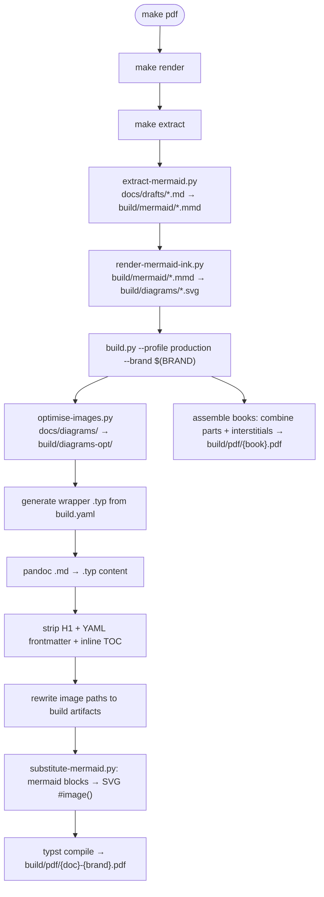

# Typst Typesetting Subrepo

A portable, automated Markdown-to-PDF typesetting and book publishing engine built on [Typst](https://typst.app/), [Pandoc](https://pandoc.org/), and Python.

This repository/directory is designed to be consumed as a standalone subrepo (via `git-subrepo`) across documentation projects (such as `new-devx` and `rhythm-of-delivery`).

---

## Architecture & Subrepo Structure

```
typst/
├── README.md               ← This comprehensive specification and guide
├── Makefile.example        ← Copy-pasteable Makefile template for host repos
├── build.yaml.example      ← Copy-pasteable build.yaml configuration template
├── plandek-template.typ    ← Backward-compatibility shim
├── brands/                 ← Brand packs (themes & vector design systems)
│   ├── neutral.typ         ← Default brand: clean typography, no customer logos/QR
│   ├── plandek.typ         ← Plandek brand: corporate logos, CETZ cover, QR code
│   └── mindrocket.typ      ← Mind Rocket brand: teal palette, SVG vector assets, procedural covers
├── interstitials/          ← Interstitial templates for multi-part books
│   ├── README.md           ← Interstitial specifications and usage
│   ├── part-divider.typ    ← Section divider with optional mini-TOC
│   └── contents.typ        ← Styled table of contents
└── scripts/                ← Pipeline automation scripts
    ├── README.md           ← Script-level documentation
    ├── build.py            ← Central build driver & CLI orchestrator
    ├── extract-mermaid.py  ← Mermaid fence extractor & manifest generator
    ├── render-mermaid-ink.py ← Incremental SVG renderer via mermaid.ink
    ├── substitute-mermaid.py ← Mermaid fence-to-SVG replacer
    ├── verify-typst-formatting.py ← Markdown formatting linter and auto-fixer
    ├── optimise-images.py  ← Image resizer & palette quantiser
    ├── build-docs.sh       ← User-friendly CLI wrapper
    ├── build-typst.sh      ← Legacy single-document compile helper
    ├── export-docx.sh      ← DOCX export helper
    ├── render-mermaid.sh   ← Local mermaid-cli fallback renderer
    └── hooks/
        └── pre-commit      ← Git hook for formatting verification
```

---

## Host Repository Contract

When imported as a subrepo into a host project, the typesetting engine expects the host repository to provide:

1. **`build.yaml`** at the host repository root:
   Declares pipeline defaults, profiles, brand registry, documents, and books.
2. **Markdown Sources**:
   Typically located in `docs/drafts/*.md` (or custom paths specified in `build.yaml`).
3. **Diagrams & Assets** (Optional):
   - `docs/diagrams/`: Manual PNG/SVG diagram replacements (override auto-rendered Mermaid).
   - `docs/assets/`: Brand logos, fonts, icons, or QR codes referenced by brand packs.
4. **Build Directory** (Gitignored):
   `build/` receives intermediate `.typ`, `.mmd`, `.svg`, and final `build/pdf/*.pdf` outputs.

---

## Pipeline Workflow



---

## Quick Start (Host Repository Setup)

Host repositories integrate the typesetting subrepo in two steps:

```bash
# 1. Copy the template Makefile to repo root
cp typst/Makefile.example Makefile

# 2. Copy the template build.yaml to repo root
cp typst/build.yaml.example build.yaml

# 3. Add dependencies with uv (or add to host pyproject.toml and run uv sync)
uv add pdf2image pillow pyyaml "qrcode[pil]" tenacity
```

The standard Makefile template provides:

```makefile
SHELL := /bin/bash
.SHELLFLAGS := -euo pipefail -c

BUILD_DIR := build
MERMAID_DIR := $(BUILD_DIR)/mermaid
DIAGRAMS_DIR := $(BUILD_DIR)/diagrams
DIAGRAMS_OPT_DIR := $(BUILD_DIR)/diagrams-opt
TYPST_DIR := $(BUILD_DIR)/typst
PDF_DIR := $(BUILD_DIR)/pdf

-include local.mk
BRAND ?= neutral
COVER_FLAGS := $(if $(COVER_STYLE),--cover-style $(COVER_STYLE),) $(if $(SEED),--seed $(SEED),)

.PHONY: all extract render pdf pdf-draft pdf-doc pdf-book cover clean lint-typst

all: pdf

lint-typst:
	uv run python typst/scripts/verify-typst-formatting.py

extract:
	@mkdir -p $(MERMAID_DIR)
	uv run python typst/scripts/extract-mermaid.py --input docs/drafts --output $(MERMAID_DIR)

render: extract
	@mkdir -p $(DIAGRAMS_DIR)
	@uv run python typst/scripts/render-mermaid-ink.py

pdf: render
	@mkdir -p $(PDF_DIR) $(TYPST_DIR) $(DIAGRAMS_OPT_DIR)
	uv run python typst/scripts/build.py --profile production --brand $(BRAND) $(COVER_FLAGS)

pdf-draft: render
	@mkdir -p $(PDF_DIR) $(TYPST_DIR)
	uv run python typst/scripts/build.py --profile draft --brand $(BRAND) $(COVER_FLAGS)

pdf-doc: render
	@mkdir -p $(PDF_DIR) $(TYPST_DIR) $(DIAGRAMS_OPT_DIR)
	uv run python typst/scripts/build.py --profile production --docs $(DOC) --no-books --brand $(BRAND) $(COVER_FLAGS)

pdf-book: render
	@mkdir -p $(PDF_DIR) $(TYPST_DIR) $(DIAGRAMS_OPT_DIR)
	uv run python typst/scripts/build.py --profile production --books $(BOOK) --no-docs --brand $(BRAND) $(COVER_FLAGS)

cover:
	@mkdir -p $(PDF_DIR) $(TYPST_DIR) $(BUILD_DIR)/covers
	uv run python typst/scripts/build.py --cover-only \
		$(if $(DOC),--docs $(DOC),) \
		$(if $(BOOK),--books $(BOOK),) \
		$(if $(BRAND),--brand $(BRAND),) \
		$(COVER_FLAGS) \
		$(if $(SEEDS),--seeds $(SEEDS),)

clean:
	@rm -rf $(BUILD_DIR)
```

---

## Brand Packs & Themes

Brand packs reside in `typst/brands/`. Each pack provides a cohesive visual theme, page geometry, typography, header/footer treatments, and cover designs.

| Brand ID | File Path | Use Case & Visual Character |
|---|---|---|
| `neutral` | `typst/brands/neutral.typ` | **Default generic pack**. Clean monochrome typography, no third-party branding, neutral corporate layout. |
| `plandek` | `typst/brands/plandek.typ` | **Plandek corporate theme**. Deep navy palette, CeTZ network diagrams, Plandek logo, closing legal footer, QR codes. |
| `mindrocket` | `typst/brands/mindrocket.typ` | **Mind Rocket theme**. Teal accent palette (`#69ABB9`), vector `icon.svg` & `logo.svg`, procedural algorithmic covers. |

### Brand Export Contract

All brand packs MUST export standard function symbols so that `build.py` can generate document wrappers without brand-specific branching:

```typst
// Core document wrapper
#let plandek-doc(
  title: "",
  subtitle: "",
  date: "",
  edition: none,
  contact: none,
  cover-style: "split-mesh",
  seed: 42,
  body
) = { ... }

// Endpage / closing back cover
#let plandek-endpiece(contact: none, body) = { ... }

// Multi-part book interstitials
#let brand-part-divider(label: "", title: "", contents: false, depth: 2) = { ... }
#let brand-contents(depth: 2) = { ... }
```

> [!NOTE]
> Endpage templates must specify `#set heading(outlined: false)` so closing page headings do not leak into the document Table of Contents.

---

## Front Cover Design & Procedural Seeds

Brand covers (such as `mindrocket`) support algorithmic procedural vector artwork generated 100% in Typst code without raster assets.

### Cover Styles

| Style | Layout | Visual Description |
|---|---|---|
| `split-mesh` *(default)* | 55/45 Split | Left pane: typography, edition, date. Right pane: procedural geometric panel with moiré interference, nested sonar rings, wave trains, and starfield constellation. |
| `minimal` | Full Width | High-whitespace modern layout, left vertical accent stripe, crisp accent rules, subtle lower-right sonar watermark. |
| `full-bleed` | Full Width | Immersive dark gradient wash spanning the entire cover with atmospheric geometry, constellation nodes, and deep tonal transitions. |

### Instant Cover Testing (`make cover`)

Fast 1-page cover compilation runs in <0.1s without executing Pandoc or diagram rendering:

```bash
# Preview default cover
make cover BRAND=mindrocket

# Preview specific seed
make cover BRAND=mindrocket SEED=42

# Preview layout styles
make cover BRAND=mindrocket COVER_STYLE=minimal SEED=100
make cover BRAND=mindrocket COVER_STYLE=full-bleed SEED=88

# Batch render multiple seeds into build/covers/
make cover BRAND=mindrocket SEEDS="0 7 13 25 42 77 88 99"
```

### Seed Value Mapping Table (`mindrocket`)

The integer `seed` modulates procedural geometry: rotation angle $s_{\text{rot}} = (s \times 13) \pmod{360}^\circ$, gradient tilt, constellation stippling, and radial ring pitch.

| Seed | Rotation | Gradient Angle | Constellation Pattern | Sonar Pitch | Visual Character |
|:---:|:---:|:---:|---|:---:|---|
| **`0`** | `0°` | `135°` | Uniform, balanced starfield | `11 mm` | **Baseline balance**: Horizontal shard alignment, 45° diagonal navy-to-teal gradient. |
| **`7`** | `91°` | `206°` | Clustered upper quadrant, open lower void | `14 mm` | **Dynamic sweep**: Near-vertical facets, steep downward gradient, curved wave trains. |
| **`13`** | `169°` | `164°` | Mid-band horizontal constellation chain | `12 mm` | **Spiral interference**: Inverted counter-rotating spiral arms, central interference. |
| **`25`** | `325°` | `170°` | Dense lower-quadrant starfield cluster | `12 mm` | **Ascending diagonal**: Acute isometric facets angled top-right, energetic motion. |
| **`42`** | `186°` | `201°` | Evenly dispersed celestial nodes | `13 mm` | **Harmonic golden balance**: Symmetrical facet alignment, balanced negative space. |
| **`77`** | `281°` | `196°` | Dual-cluster stippling at spiral centers | `12 mm` | **High-contrast atmosphere**: Dense moiré interference, prominent cyan accent wave lines. |
| **`88`** | `64°` | `179°` | Outer perimeter stellar ring | `11 mm` | **Cross-page gradient**: Near-horizontal gradient wash, crystalline diagonal shards. |
| **`99`** | `207°` | `162°` | Dense central stellar nexus | `14 mm` | **Turbulent nexus**: Maximum angular displacement, swirling micro-dot spirals. |

---

## Books & Interstitial Dividers

Multi-part books compile multiple standalone Markdown drafts into a single cohesive publication with unified pagination, shared headers/footers, and interstitial divider pages.

### Book Configuration in `build.yaml`

```yaml
books:
  complete-guide:
    title: "Engineering Leadership\nHandbook"
    subtitle: "Principles · Practices · Metrics"
    date: "March 2026"
    output: build/pdf/leadership-handbook.pdf
    end-page:
      mindrocket: docs/drafts/end-page-mindrocket.md
      neutral: docs/drafts/end-page-neutral.md
    parts:
      - type: interstitial
        params:
          style: part-divider
          label: "Part 1"
          title: "Foundations"
          contents: true
          depth: 2
      - type: document
        doc: vision
      - type: interstitial
        params:
          style: part-divider
          label: "Part 2"
          title: "Execution"
          contents: true
          depth: 2
      - type: document
        doc: roadmap
```

### Pagebreak Behavior

Interstitials enforce `#pagebreak(weak: true)` before divider elements. Weak pagebreaks ensure that if preceding document content terminates cleanly at a page boundary, extraneous blank pages are not introduced into the compiled PDF.

---

## Mermaid Diagram Handling

1. **Extraction**: `extract-mermaid.py` parses Markdown, extracts ` ```mermaid ` fences, and stores `.mmd` files in `build/mermaid/{doc}/{slug}.mmd` alongside a master `manifest.json`.
2. **Rendering**: `render-mermaid-ink.py` converts `.mmd` to SVG via the `mermaid.ink` service with incremental SHA-256 hash checks (`.svg.hash`), retrying transient network errors with exponential backoff.
3. **Substitution**: `substitute-mermaid.py` replaces code blocks in the generated Typst content with Typst `#image(...)` inclusions.
4. **Manual Image Overrides**:
   If an author places a Markdown image reference directly before a Mermaid block:
   ```markdown
   

   ```mermaid
   flowchart LR
       ...
   ```
   The build pipeline detects the override, suppresses automated rendering, and embeds the manual image located in `docs/diagrams/target-architecture-v2.png`.

---

## Markdown Formatting Rules & Linter

Typst requires specific Markdown formatting conventions to produce clean typesetting without layout bugs:

1. **Spacing After Diagrams**: All diagram fences or manual diagram image references must be followed by **at least 2 blank lines**.
2. **Section Separation**: Major section headings (`## Level 2`) must be preceded by a horizontal rule (`---`), except when immediately following document frontmatter or part-divider interstitials.
3. **No Orphan Rules**: A horizontal rule must never directly precede another heading without intermediate content.

### Enforcing and Fixing Rules

```bash
# Verify formatting across docs/drafts/
make lint-typst

# Or run the script directly with auto-remediation:
uv run python typst/scripts/verify-typst-formatting.py --fix

# Check only staged files before commit:
uv run python typst/scripts/verify-typst-formatting.py --staged
```

---

## Instructions for AI Agents Authoring Documents

When generating or editing Markdown documents for this typesetting engine:

1. **Frontmatter**: Include standard YAML frontmatter:
   ```yaml
   ---
   title: "Document Title"
   subtitle: "Clear Explanatory Subtitle"
   author: "Mind Rocket"
   date: "March 2026"
   ---
   ```
2. **Excluding Sections from PDF**: Wrap content intended only for GitHub / raw Markdown (such as revision histories or internal notes) in Typst skip markers:
   ```markdown
   <!-- typst-skip-start -->
   ## Revision History
   | Date | Author | Notes |
   <!-- typst-skip-end -->
   ```
3. **Diagram Formatting**: Always include a `title:` in the Mermaid diagram frontmatter:
   ````markdown
   ```mermaid
   ---
   title: System Architecture Overview
   ---
   flowchart LR
       Client --> Gateway --> Service
   ```


   ````
   *(Ensure 2 blank lines follow the closing backticks!)*
4. **Section Breaks**: Place `---` before all `## ` headings.
5. **Always Run Linter**: After modifying any markdown file, run `make lint-typst` (or `uv run python typst/scripts/verify-typst-formatting.py --fix`) to ensure zero build errors.

---

## Dependencies

- **Typst**: `brew install typst` (>= 0.12)
- **Pandoc**: `brew install pandoc` (>= 3.1)
- **Python**: `>= 3.14` managed via [uv](https://docs.astral.sh/uv/)
- **Python Packages** (add via `uv add pdf2image pillow pyyaml "qrcode[pil]" tenacity` or in `pyproject.toml`):
  - `pillow>=12.1.1` (image resizing and quantisation)
  - `pyyaml>=6.0.3` (config and manifest loading)
  - `tenacity>=9.1.4` (exponential retry handling)
  - `qrcode[pil]>=8.2` (dynamic QR code generation for covers/backpages)
  - `pdf2image>=1.17.0` (cover and page extraction preview helpers)
